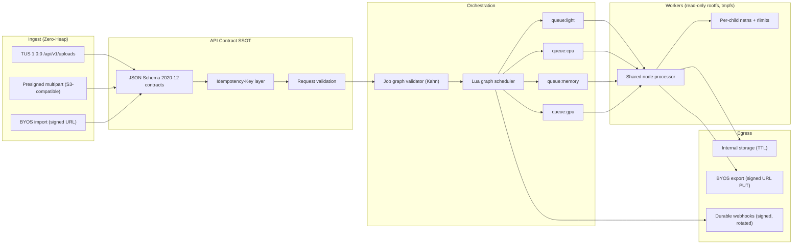

# EasyConvert 차세대 고도화 실행 계획서 v2 (Agent-Executable)

> **대상 커밋**: `main @ 79c7a6c` (2026-10-03 기준)
> **문서 성격**: 실행 정본(SSOT). 구현 에이전트는 이 문서의 Work Package(WP) 단위로만 작업한다.
> **v1 대비 변경**: v1의 사실 오류 7건 정정 + 신규 치명 결함 9건 추가 + 모든 항목을 PR 단위 WP로 분해 + 독립 오라클 기반 검증 게이트 명시 + 근거 없는 성능 수치 전면 삭제.

---

## 0. 구현 에이전트 실행 프로토콜 (반드시 먼저 읽을 것)

### 0.1 작업 단위와 순서
1. **WP 하나 = 이슈 하나 = 브랜치 하나 = PR 하나.** 둘 이상의 WP를 한 PR에 묶지 않는다.
2. Wave 순서를 지킨다. 같은 Wave 안에서는 `의존` 칸이 비어 있는 WP부터 진행한다.
3. 각 WP 착수 전: `git switch main && git pull --ff-only` → `git switch -c <WP 브랜치명>`.
4. 각 WP 완료 시 표준 파이프라인: 로컬 게이트 통과 → `gh issue create` → `gh pr create` (본문에 `Closes #N`) → `aquila-review` 실행 및 코멘트 게시 → 지적 0건 → CI `verify` green → `gh pr edit <N> --add-label automerge`.
5. GitHub 텍스트(이슈/PR/커밋)는 영어 명령형. 외부 서비스명·제품명 언급 금지.

### 0.2 모든 WP 공통 로컬 게이트 (Definition of Done)
```bash
npm run guard:anti-cheat      # 위반 0건 (Wave 0 이후에는 baseline ratchet 포함)
npm run lint                  # 에러 0건
npx tsc --noEmit              # 타입 에러 0건
npx vitest run <WP가 추가/수정한 테스트 파일들>   # 전부 통과, skip 사유 명시
npm test                      # 전체 회귀 (기존 통과 테스트가 새로 실패하면 안 됨)
npm run build                 # Next 빌드 성공
```
- 외부 도구 의존 테스트는 로컬에 도구가 없으면 **명시적 skip**(Wave 0의 `oracleTest` 사용)으로 보고하고, PR 본문에 "skipped locally, executed in CI"를 적는다.
- **기존 테스트의 기대값을 바꿔야 한다면** 그 이유(계약 변경)를 PR 본문 `Contract changes` 섹션에 테스트 이름별로 기재한다. 이유 없는 기대값 완화는 금지.

### 0.3 정지 조건 (사용자에게 질문하고 멈출 것)
- §9 설계 결정(D1~D12) 중 해당 WP가 의존하는 항목이 **승인되지 않은 경우**.
- 새 런타임 의존성(npm 패키지, apt 패키지) 추가가 WP 명세에 없는 경우.
- 기존 공개 API 응답 스키마, 기존 테스트의 계약을 명세에 없는 방식으로 바꿔야 하는 경우.
- 시크릿, 권한, 배포, DB/Redis 데이터 마이그레이션, force-push가 필요한 경우.

### 0.4 금지 사항 (위반 시 WP 반려)
- 프로덕션 코드를 import해 기대값을 만드는 순환 오라클. 오라클은 독립 CLI(ffprobe, pdfinfo, qpdf, 7z, unrar, tar, zstd, ImageMagick, libraw, tesseract)나 서드파티 파서, 손으로 계산한 상수여야 한다.
- 도구가 없을 때 조용히 통과시키는 코드 (`if (isOracleToolAvailable(x)) { verify }` 형태 포함).
- `toBeDefined()`, `not.toThrow()`, `toBeGreaterThan(0)`, 헤더 문자열 `toContain`**만으로** 끝나는 테스트.
- 입력을 무시하는 인코더, `.slice(0, N)` 형태의 잘라내기, 기하/데이터를 지어내는 폴백.
- 실패 시 다른 엔진으로 **조용히** 떨어지는 폴백. 폴백은 "엔진 사용 불가(ENGINE_UNAVAILABLE)"일 때만 허용되고, 변환 자체가 실패한 경우는 오류로 끝나야 한다.

---

## 1. Ground-Truth 정정표 (v1 → v2)

| # | v1 주장 | 검증된 사실 | v2 조치 |
|---|---|---|---|
| C1 | DAG를 "BullMQ FlowProducer"로 구현 | `package.json`에 `bullmq`가 없음. [`bullmq-engine.ts`](file:///Volumes/MACSSD/Projects/GitProjects/easyconvert/src/lib/queue/bullmq-engine.ts)는 자체 구현 큐(in-memory `Queue` + Redis Lua `DistributedBullMQAdapter`)이고 parent/child 개념이 없음 | 자체 엔진 위에 Lua 기반 그래프 스케줄러 구현 (WP-31) |
| C2 | RAW는 정사각형만 처리되어 실제 카메라 파일이 100% 실패 | 정사각형 제약은 **헤더 없는 폴백**에만 있음 ([`image.ts#L2168-L2189`](file:///Volumes/MACSSD/Projects/GitProjects/easyconvert/src/lib/conversions/image.ts#L2168-L2189)). 직사각형 DNG는 TIFF 경로(L1690-2167)로 처리됨 | 실제 결함으로 교체: Compression(259) 미검사, Photometric(262) 미파싱, MM 엔디언 16비트 오독, 홀수 byteOffset 예외, packed 10/12/14bit 미지원, CFA 패턴 RGGB 고정, `convertImage`가 options를 전달하지 않음(L2220), 8비트 강제 (WP-47) |
| C3 | 웹훅 키 로테이션 유예 검증이 없음 | 수신 측 `verifySignatureWithDualSecrets`는 존재 ([`webhook-dispatcher.ts#L128`](file:///Volumes/MACSSD/Projects/GitProjects/easyconvert/src/lib/api-keys/webhook-dispatcher.ts#L128)). 빠진 것은 **송신 측** 다중 서명, 시크릿 저장소/로테이션 API, 영속 재시도 | WP-12 범위 재정의 |
| C4 | 문서 변환에 HarfBuzz/Bidi 엔진이 없음 | LibreOffice 경로는 내부적으로 텍스트 셰이핑을 수행함. 실제 결함은 **폰트 부재**(Arabic/Hebrew/Thai/Indic 폰트 없음)와 순수 TS PDF 생성 경로(pdfkit/pdf-lib)의 셰이핑 부재 | WP-42 범위 재정의 |
| C5 | OCR 언어 7개 지원 | `langMap`에는 7개가 있지만 컨테이너에는 `eng`, `kor`만 설치됨. 미지원 언어는 **조용히 `eng`로 대체** | WP-48, 그리고 Fail-open 수정은 WP-03 |
| C6 | `convertStepToMesh`에 위상 검증 연결 | 그런 함수는 없음. 실제 진입점은 `tessellateCadText`(L3882), `tessellateCadBuffer`(L3957), `extractStepBRepMesh`(L3434) | WP-46 |
| C7 | AMaZE SIMD 6~10배, LOD 70%, zstd 사전 30% 등 수치 | 측정 근거가 없음. 저장소에는 이미 `phase-4-wasm-simd-and-webgpu`, `cad-curvature-quadtree`, `zstd-dict.ts`가 존재 | 수치를 삭제하고 "기존 구현 확인 → 벤치마크 → 개선" 가설 검증형 WP로 전환 (WP-61) |

## 2. 신규 발견 결함 (v1에 없던 것, 우선순위 순)

| ID | 심각도 | 결함 | 근거 |
|---|---|---|---|
| N1 | **Critical (보안)** | 멀티파트 업로드 API에 인증이 전혀 없음. 누구나 서버 디스크에 무제한 기록 가능 | [`storage/multipart/route.ts`](file:///Volumes/MACSSD/Projects/GitProjects/easyconvert/src/app/api/storage/multipart/route.ts): `validateApiAccess` 호출 없음, 청크를 `req.arrayBuffer()`로 힙에 적재 |
| N2 | **Critical (보안)** | 비밀번호를 지정해도 7z 바이너리가 없으면 **암호화되지 않은** ZIP/7z가 생성됨 (Fail-open) | `archive.ts` `createZipArchive` L166-200, `create7zArchive` L1772-1776 → JSZip/TS writer로 폴백 |
| N3 | High (보안) | 7z 헤더 암호화(`-mhe=on`), ZIP AES-256(`-mem=AES256`)이 없음 → 파일명 평문 노출, ZipCrypto 사용 | `engines.ts` L488-494, `archive.ts` L147 |
| N4 | High (보안) | 웹훅 시크릿 미지정 시 하드코딩된 공용 시크릿 `'easyconvert-default-secret'`으로 서명 → 서명이 위조 가능 | [`conversion-queue.ts#L200`](file:///Volumes/MACSSD/Projects/GitProjects/easyconvert/src/lib/queue/conversion-queue.ts#L200), L236 |
| N5 | Medium (보안) | 오류 응답에 서버 디스크 절대경로 노출 (`Storage file missing on disk: "${stored.filePath}"`) | `v1/jobs/route.ts` (spoof 검사 블록) |
| N6 | Medium (보안/에어갭) | tesseract.js가 로컬 traineddata를 못 찾으면 원격 langPath로 다운로드 시도 → 에어갭 위반 | `ocr.ts` L70-96 |
| N7 | High (무결성) | 네이티브 엔진 실패를 `withSandboxDir`가 모두 삼키고 `null` 반환 → 다음 엔진으로 조용히 폴백 | `engines.ts` L139-155 |
| N8 | High (무결성) | STEP/IGES에서 B-Rep 추출 실패 시 bare 점들로 삼각형을 **지어냄** (`buildTrianglesFromPoints`) | `cad-nurbs.ts` L4246 + `vector-cad.ts` L1323-1350 |
| N9 | Medium (무결성) | `tasks` 배열이 스키마 검증 없이 그대로 큐에 들어감. `ConversionOptions.pages`, `sheetIndex`, `aspectRatio`, `fastStart`, `duration`(FFmpeg 경로)은 선언만 되고 읽히지 않음 | `v1/jobs/route.ts`, `types.ts` |
| N10 | Medium (무결성) | `verifyWatertightManifoldMesh`가 `χ === 2`를 요구 → genus>0(구멍 뚫린 부품)이나 다중 컴포넌트 솔리드를 비수밀로 오판. 게이트로 바로 연결하면 정상 모델이 거부됨 | `cad-nurbs.ts` L2329 |
| N11 | Medium (충실도) | FFmpeg: 해상도 지정 시 짝수 보정 스킵 → 홀수 치수 출력 가능, VAAPI 경로에 `-pix_fmt yuv420p` 중복, `prores` 분기 없음, webm이 videoCodec 무시, 미디어 타임아웃 30초 고정 | `media-ffmpeg-args.ts` L117-250, `media.ts` L190 |
| N12 | Medium (충실도) | 다중 시트 XLSX→CSV가 `### Sheet:` 구분자로 합쳐져 RFC 4180 단일 테이블이 아님. CR/LF 포함 셀이 인용되지 않음 | `office.ts` L5641-5672 |
| N13 | Medium (테스트) | 껍데기/순환 테스트: `universal-engine-coverage.test.ts` L124-127, `multi-domain-expansion.test.ts` L195/L209, `phase-1-fail-closed-and-edge-integrity.test.ts` L48(프로덕션 `encodeCgm` 출력을 픽스처로 사용) | §5 WP-01 |

---

## 3. 목표 아키텍처 개요



---

## 4. Wave / WP 총괄표

| Wave | WP | 제목 | 위험 분류 | 의존 | 결정 의존 |
|---|---|---|---|---|---|
| 0 | WP-01 | 테스트 무결성: 오라클 strict화 + 가드 강화 + ratchet baseline | test | — | — |
| 0 | WP-02 | 보안 핫픽스: 업로드 인증, 기본 시크릿 제거, 경로 노출 제거 | **security** | — | — |
| 0 | WP-03 | Fail-closed 핫픽스: 아카이브 암호화, 엔진 폴백, OCR 원격 다운로드, 가짜 인코더 비활성화 | integrity | WP-01 | — |
| 1 | WP-10 | API 계약 SSOT (JSON Schema) + 요청 검증 + OpenAPI 정합화 | api | WP-02 | D1 |
| 1 | WP-11 | Idempotency-Key | api | WP-10 | — |
| 1 | WP-12 | 엔터프라이즈 웹훅: 다중 서명, 로테이션, 영속 재시도 | **security** | WP-02, WP-10 | D2 |
| 1 | WP-13 | 사용량 미터링 원장 + 표준 RateLimit 헤더 | api | WP-10 | D3 |
| 2 | WP-20 | 스토리지 스트리밍 API, 2GB `buffer` 크래시 제거 | storage | WP-01 | — |
| 2 | WP-21 | TUS 1.0.0 업로드 + 기존 multipart 스트리밍화 | storage | WP-02, WP-20 | — |
| 2 | WP-22 | Presigned 직접 업로드 (S3 호환) | storage | WP-20 | D4 |
| 2 | WP-23 | BYOS import/export (signed URL 우선) | **security** | WP-20, WP-10 | D5 |
| 3 | WP-30 | 작업 그래프 스키마 + 검증 + 선형 tasks 어댑터 | orchestration | WP-10 | — |
| 3 | WP-31 | Lua 그래프 스케줄러 (Fan-out/Fan-in) | orchestration | WP-30, WP-20 | — |
| 3 | WP-32 | 공용 노드 프로세서 (OCI 워커의 tasks 무시 결함 해소) | orchestration | WP-31 | — |
| 3 | WP-33 | 리소스 클래스별 큐 라우팅 + 우선순위 | orchestration | WP-32 | — |
| 4 | WP-40 | 페이지 범위 + 진짜 페이지 래스터화 + 다중 출력 번들 | engine | WP-03, WP-10 | — |
| 4 | WP-41 | PDF 워터마크, AES-256 암호화/권한, PDF/A | engine | WP-40 | D6 |
| 4 | WP-42 | 글로벌 폰트 팩 + CTL 라우팅 | engine | WP-03 | — |
| 4 | WP-43 | 스프레드시트: 시트 분할, RFC 4180, Print Area, 수식 캐시 | engine | WP-10 | — |
| 4 | WP-44 | 미디어: 인코딩 제어, 필터, 서라운드, 자막, 썸네일, HLS/DASH | engine | WP-10, WP-31 | D7 |
| 4 | WP-45 | 아카이브: create/extract/inspect, 멀티볼륨, RAR 정리 | engine | WP-03, WP-31 | D8 |
| 4 | WP-46 | CAD: 위상 판정 수정, 게이트 연결, 단위, 진짜 STEP/IGES/EMF/WMF/CGM 인코더 | engine | WP-03 | D9 |
| 4 | WP-47 | 카메라 RAW: DNG 정합성, 16비트 선형 파이프라인, WB/HDR/광색역 | engine | WP-03 | D10 |
| 4 | WP-48 | OCR: 언어팩, hOCR/ALTO/TSV, 세로쓰기, Smart OCR, 텍스트 레이어 정밀화 | engine | WP-03, WP-40 | D11 |
| 5 | WP-50 | 컨테이너 격리: SYS_ADMIN 제거, RO rootfs, 자식 프로세스 netns, 자가 재활용 | **infra** | WP-33 | D12 |
| 5 | WP-51 | GPU 가속 매트릭스 + 안전한 소프트웨어 폴백 | infra | WP-50 | — |
| 6 | WP-60 | 2/5/10GB 실파이프라인 소크 (nightly) | test | WP-21, WP-32 | — |
| 6 | WP-61 | 알고리즘 최적화 (가설 → 벤치마크 → 채택) | perf | WP-47, WP-46 | — |
| 6 | WP-62 | 다언어 SDK 생성 파이프라인 (TS/Python/Go/Java) | dx | WP-10~13 | D1 |

> **PR 분리 원칙 준수**: security(WP-02, 12, 23), infra(WP-50, 51)는 다른 WP와 절대 묶지 않는다.

---

## 5. Wave 0 — 무결성 기반 복구

### WP-01 테스트 무결성: 오라클 strict화 + 가드 강화 + ratchet
- **Issue**: `Enforce strict oracle tooling and close anti-cheat guard blind spots`
- **Branch**: `test/strict-oracles-and-guard-ratchet`

**변경 파일 및 내용**
1. [`tests/helpers/differential-oracle.ts`](file:///Volumes/MACSSD/Projects/GitProjects/easyconvert/tests/helpers/differential-oracle.ts)
   - `isOracleToolAvailable(...)`로 검증 블록을 감싸 우회하는 지점 전부를 `requireOracleTool(tool)`로 교체한다. 대상 라인: 2112, 2238, 2240, 2258, 2287, 2315, 2331, 2347, 2396, 2421, 2440, 2666, 2685, 2715, 2768, 2799.
   - `requireOracleTool(tool): string`: 도구가 없으면 **항상** `OracleToolMissingError`를 던진다. 환경변수로 반환값을 바꾸지 않는다.
   - `verifyAudioWithFfmpeg`, `verifyImageWithImageMagick`, `verifyPdfWithPoppler`: "도구 없음 → `false` 반환" 분기를 제거하고 `requireOracleTool`을 사용한다. 이제 `false`는 "디코딩 실패"만을 의미한다.
   - tar/zstd/7z처럼 `else` 분기에서 내부 `check*Integrity`를 쓰는 곳(2315/2331/2347)은, 내부 검사를 **항상** 수행하고 외부 CLI 검사는 `requireOracleTool`로 **추가** 수행하도록 바꾼다.
2. `tests/helpers/oracle-test.ts` (신규)
   - `oracleTest(name, tools: ExternalOracleTool[], fn, timeout?)` 래퍼. 도구가 없으면 `ORACLE_STRICT_MODE==='1'`에서는 테스트를 **실패**시키고, 아니면 vitest 컨텍스트의 `ctx.skip()`을 호출해 SKIP으로 집계한다. 본문 실행 중 발생한 `OracleToolMissingError`도 같은 규칙으로 처리한다.
3. `tests/oracle-toolchain-preflight.test.ts` (신규): `ORACLE_STRICT_MODE==='1'`이면 CI가 설치하는 도구 목록(`.github/workflows/ci.yml` L42-55와 같은 목록)이 전부 존재하는지 단언한다. 하나라도 없으면 실패하고, 도구명과 탐색 경로를 출력한다.
4. [`tests/phase-6-large-stream-and-soak.test.ts`](file:///Volumes/MACSSD/Projects/GitProjects/easyconvert/tests/phase-6-large-stream-and-soak.test.ts) L148, L162, L186의 positive guard를 `oracleTest`로 교체한다. L25 테스트의 sha256은 길이 64 단언 대신, 결정적 생성기의 기대 다이제스트(테스트 파일 안에 **상수로** 박아 둔 값, 독립적으로 `node:crypto`로 1회 계산해 기록)와 비교한다.
5. [`scripts/guard-anti-cheat.ts`](file:///Volumes/MACSSD/Projects/GitProjects/easyconvert/scripts/guard-anti-cheat.ts) — 정규식 대신 `typescript` 컴파일러 API(이미 devDependency) 기반 AST 규칙을 추가한다.
   - **G2b Positive-guard skip**: `tests/**`에서 `if (isOracleToolAvailable(..) | getOracleToolPath(..) | <tool>Path)` 블록에 `else`가 없고 블록 안에 `verify*`/`check*`/`expect` 호출이 있으면 위반.
   - **G3b Truncation**: `src/lib/conversions/**`, `src/worker/**`에서 함수 이름이 `encode*|write*|create*|serialize*`인 함수 본문에 `.slice(0, <숫자 리터럴>)`가 있으면 위반.
   - **G3c Ignored input**: 위 이름 패턴의 **export된** 함수가 첫 번째 파라미터를 본문에서 한 번도 참조하지 않으면 위반 (`_` 접두사 파라미터 포함).
   - **G4b Weak-only assertions**: `tests/**`의 각 `it/test` 블록에서 모든 `expect` 매처가 `{toBeDefined, toBeTruthy, not.toThrow, toBeGreaterThan(0), toBeInstanceOf}` 또는 문자열 리터럴 `toContain`뿐이면 위반.
   - **G1b**: 순환 모킹 검사 범위를 `tests/**/*.test.ts`까지 확장한다. 단 **production 함수를 호출해 그 출력으로 기대값을 만드는 패턴**만 위반으로 본다: 같은 테스트 안에서 production 함수 A의 출력이 production 함수 B(A의 역함수 이름쌍: `encodeX/parseX`, `createX/extractX`, `compressX/decompressX`)의 입력으로만 쓰이고 독립 오라클 호출이 없으면 위반. 이것은 **경고 레벨**로 시작한다.
6. `scripts/anti-cheat-baseline.json` (신규): 새 규칙이 기존 코드에서 찾은 위반을 `{rule, file, symbol, reason, owningWP}`로 기록한다. 가드는 baseline에 없는 위반이 있으면 실패하고, **baseline에 있는데 더 이상 발생하지 않는 항목이 있으면 baseline 갱신을 요구**하며 실패한다(ratchet: 줄어들 수만 있음). 각 항목의 `owningWP`는 그 위반을 없앨 WP ID다 (예: `encodeStep` → WP-46).

**테스트 (독립 오라클)**
- `tests/guard-anti-cheat-rules.test.ts` (신규): 위반 예제 문자열과 정상 예제 문자열을 임시 디렉터리에 쓰고, 가드 스크립트를 `tsx`로 **하위 프로세스**로 실행해 종료 코드와 보고된 규칙 ID를 단언한다. 규칙마다 양성/음성 예제를 최소 1개씩 둔다.

**수용 기준**
- 도구가 하나도 없는 환경에서 `npm test` 실행 시 외부 오라클 테스트가 전부 SKIP으로 집계되고 PASS로 집계되지 않는다 (`vitest --reporter=json` 출력의 `skipped` 수로 확인).
- `ORACLE_STRICT_MODE=1`이고 `ffmpeg`가 PATH에 없을 때 preflight 테스트가 실패한다.
- baseline 항목 수가 PR 본문에 보고되고, 항목마다 소유 WP가 지정되어 있다.

**커밋**
- `test(oracle): fail closed when external oracle tools are missing`
- `test(helpers): add oracleTest wrapper and toolchain preflight`
- `chore(guard): add AST rules for positive guards, truncation, ignored inputs, weak assertions`
- `chore(guard): add ratcheting violation baseline`

### WP-02 보안 핫픽스 (security PR 단독)
- **Issue**: `Require authentication for uploads and remove insecure webhook and path disclosures`
- **Branch**: `fix/security-upload-auth-and-secrets`

**변경**
1. [`src/app/api/storage/multipart/route.ts`](file:///Volumes/MACSSD/Projects/GitProjects/easyconvert/src/app/api/storage/multipart/route.ts)
   - 모든 action에서 `validateApiAccess(req, { requiredUnits: 0, requiredScope: 'convert:write' })`를 호출한다. 실패하면 `createProblemDetailsResponse` 401/403을 반환한다.
   - `initiate` 시 `uploadId → ownerUserId`를 기록하고, `chunk`/`complete`/`abort`에서 소유자가 일치하지 않으면 404를 반환한다 (존재 여부 비노출, 기존 `STORAGE_OBJECT_NOT_FOUND` 재사용).
   - `totalSize` 상한을 tier별로 적용한다 (기존 pricing/tier 정보 사용, 정의가 없으면 상수 `MAX_MULTIPART_TOTAL_BYTES`).
   - 파트 하나의 상한은 `MAX_PART_BYTES = 64 MiB`. 초과 시 413.
   - 완료된 객체 키는 기존 owner-access 규칙에 맞게 사용자 네임스페이스로 등록한다 ([`owner-access.ts`](file:///Volumes/MACSSD/Projects/GitProjects/easyconvert/src/lib/api-keys/owner-access.ts)와 [`key-namespace.ts`](file:///Volumes/MACSSD/Projects/GitProjects/easyconvert/src/lib/storage/key-namespace.ts) 확인 후 동일 규칙 적용).
2. [`src/lib/queue/conversion-queue.ts`](file:///Volumes/MACSSD/Projects/GitProjects/easyconvert/src/lib/queue/conversion-queue.ts) L200, L236: `|| 'easyconvert-default-secret'`을 제거한다. `webhookSecret`이 없으면 `webhookUrl` 등록 단계(API)에서 400을 반환한다. 이미 큐에 들어 있는 시크릿 없는 작업은 웹훅을 보내지 않고 `console.warn` + DLQ 사유 `missing_webhook_secret`으로 기록한다.
3. `src/app/api/v1/jobs/route.ts`, `src/app/api/v1/convert/route.ts` 등 `filePath`를 응답 문자열에 넣는 모든 곳: `grep -rn "filePath}" src/app/api`로 찾아 일반 메시지(`Stored object is unavailable.`)로 바꾸고 상세 경로는 서버 로그에만 남긴다.

**테스트**
- `tests/security-upload-auth.test.ts`: (a) 인증 없이 initiate/chunk/complete → 401, (b) 사용자 A의 uploadId로 사용자 B가 chunk → 404, (c) 64 MiB+1 파트 → 413, (d) 정상 흐름 → 완료 객체의 소유자 = A.
- `tests/webhook-secret-required.test.ts`: webhookUrl만 있고 secret이 없는 작업 생성 → 400. 로컬 HTTP 서버로 수신된 요청이 0건임을 단언.
- `tests/error-path-disclosure.test.ts`: 디스크에서 파일을 지운 storageKey로 작업 생성 → 응답 본문에 `os.tmpdir()`, `EASYCONVERT_STORAGE_DIR`, `/` 절대경로 패턴이 없음.

**커밋**: `fix(storage): require auth and ownership for multipart uploads`, `fix(webhooks): reject webhook registration without a secret`, `fix(api): stop leaking storage paths in error responses`

### WP-03 Fail-closed 핫픽스
- **Issue**: `Fail closed on unencrypted archives, swallowed engine errors, OCR egress, and placeholder encoders`
- **Branch**: `fix/fail-closed-engines`

**변경**
1. **아카이브 암호화** (`archive.ts` L120-200, L1772-1776, `engines.ts` L456-502)
   - `password`가 주어졌는데 암호화 가능한 경로(7z 바이너리)가 없으면 `ArchiveEncryptionUnavailableError`를 던진다. JSZip/TS writer로 폴백하지 않는다.
   - 7z 생성 인자: `-t7z -mhe=on -p` (stdin 패스워드 유지). ZIP 생성 인자: `-tzip -mem=AES256 -p`.
   - `tar.*` + password 조합은 `UnsupportedOptionError`로 거부한다 (현재는 조용히 무시).
2. **엔진 폴백** (`engines.ts` `withSandboxDir` L139-155, `executeWorkerConversion` L735-811)
   - 에러를 두 종류로 나눈다: `EngineUnavailableError`(바이너리 없음, 포맷 미지원) → 다음 엔진 허용 / 그 외(종료코드≠0, 타임아웃, 출력 없음) → **즉시 throw**.
   - `WorkerConversionResult`에 `fallbackChain: string[]`을 추가해 시도한 엔진과 사유를 job 로그에 남긴다.
3. **OCR 원격 다운로드 차단** (`ocr.ts` L59-96)
   - tesseract.js에 `langPath`를 로컬 디렉터리(`TESSDATA_PREFIX` → 저장소 루트 traineddata 순)로 강제하고, `cacheMethod: 'none'`과 오프라인 옵션을 명시한다. 로컬에 해당 언어가 없으면 `OcrLanguageUnavailableError`를 던진다.
   - `langMap`에 없는 언어 코드는 `eng`로 대체하지 않고 400 계열 오류로 처리한다.
   - CLI 경로의 하드코딩된 `confidence: 0.95`는 WP-48에서 TSV 기반으로 교체하므로, 여기서는 `confidence: null`로 바꾸고 타입을 `number | null`로 넓힌다 (거짓 신뢰도 제거).
4. **가짜 인코더 비활성화** (WP-46에서 진짜 구현이 들어올 때까지)
   - `encodeEmf`, `encodeWmf`, `encodeCgm`, `encodeStep`, `encodeIges` 호출부(`vector-cad.ts` L369/374/379/563/569)에서 `UnsupportedTargetError('... encoder is not available')`를 던진다. 함수 본문은 WP-46에서 교체하므로 여기서는 export만 유지한다.
   - [`registry.ts`](file:///Volumes/MACSSD/Projects/GitProjects/easyconvert/src/lib/registry.ts)에서 해당 타깃을 `available: false`(또는 기존 레지스트리의 동등 필드)로 표시해 UI/API 포맷 목록에서 숨긴다. 필드가 없으면 `disabledTargets` Set을 추가한다.
   - `buildTrianglesFromPoints` 폴백(`cad-nurbs.ts` L4246)과 `parse3dCad`의 정규식 점 폴백(`vector-cad.ts` L1323-1350)을 제거하고 `CadGeometryUnavailableError`를 던진다.
5. 위 변경으로 깨지는 껍데기 테스트(§2 N13)는 **기대값을 "명확한 오류"로 바꾼다** (예: `rejects.toThrow(/encoder is not available/)`). WP-46에서 독립 오라클 기반 테스트로 다시 교체한다. baseline에서 해당 항목을 제거한다.

**테스트**
- `tests/archive-encryption-fail-closed.test.ts`: 7z 경로를 존재하지 않는 경로로 주입(환경변수 오버라이드, `BINARY_PATHS` 참고)한 상태에서 password ZIP 생성 → `ArchiveEncryptionUnavailableError`. `oracleTest(['7z'])`: 생성한 7z를 `7z l -slt -p<wrong>`로 열었을 때 **파일 목록을 얻을 수 없음**(헤더 암호화), 올바른 비밀번호로 `7z t` 성공, ZIP은 `7z l -slt` 출력에 `Method = AES-256`.
- `tests/engine-fallback-classification.test.ts`: 항상 종료코드 1을 내는 가짜 바이너리 스크립트를 임시 디렉터리에 만들어 `BINARY_PATHS` 오버라이드로 주입 → `executeWorkerConversion`이 throw하는지(폴백하지 않음) 확인. 존재하지 않는 경로 → 다음 엔진으로 진행하고 `fallbackChain`에 사유가 기록되는지 확인.
- `tests/ocr-offline.test.ts`: `undici`의 `MockAgent`를 전역 디스패처로 설정하고 `disableNetConnect()` → 존재하지 않는 언어 요청 시 네트워크 시도 없이 `OcrLanguageUnavailableError`.

**커밋**: `fix(archive): refuse to emit unencrypted archives when a password is set`, `fix(archive): enable 7z header encryption and AES-256 zip`, `fix(worker): stop swallowing native engine failures`, `fix(ocr): block remote language downloads and silent language fallback`, `fix(cad): disable placeholder vector and CAD encoders`

---

## 6. Wave 1 — API 계약 · 멱등성 · 웹훅 · 미터링

### WP-10 API 계약 SSOT + 요청 검증
- **Issue**: `Introduce a single schema source for API contracts and validate requests`
- **Branch**: `feat/api-contract-ssot`
- **의존성 추가 (D1 승인 필요)**: `ajv` (JSON Schema 2020-12, OpenAPI 3.1과 동일 방언), `ajv-formats`.

**변경**
1. `src/lib/api/contracts/` (신규)
   - `enums.ts`: `PIPELINE_OPERATIONS = ['convert','ocr','archive','optimize'] as const`. `watermark`는 WP-41, `thumbnail`/`package` 등은 해당 WP에서 **구현과 동시에** 추가한다. `transform`은 정의가 없으므로 넣지 않는다.
   - `schemas.ts`: `ConversionOptionsSchema`, `PipelineTaskSchema`, `JobCreateRequestSchema`, `ProblemDetailsSchema`, `JobResourceSchema`. `$id`는 `https://easyconvert.local/schemas/<name>.json` 형식으로 둔다.
   - `validate.ts`: Ajv 인스턴스(strict mode, `allErrors`, `coerceTypes: false`, `removeAdditional: false`)와 `validateOrProblem(schema, data) → { ok } | { problem: ProblemDetails(422, errors[]) }`.
   - 각 옵션 스키마에는 숫자 범위와 패턴을 명시한다 (예: `dpi` 72-600, `audioBitrate` `^\d+[kK]?$`).
2. [`src/lib/types.ts`](file:///Volumes/MACSSD/Projects/GitProjects/easyconvert/src/lib/types.ts) L206-211: `operation: (typeof PIPELINE_OPERATIONS)[number]`로 바꾼다.
3. [`src/app/api/openapi.json/route.ts`](file:///Volumes/MACSSD/Projects/GitProjects/easyconvert/src/app/api/openapi.json/route.ts): `components.schemas`를 contracts에서 import해 조립한다. 손으로 쓴 중복 스키마는 삭제한다. 경로 정의는 유지한다.
4. `v1/jobs/route.ts`, `v1/convert/route.ts`: 본문 파싱 직후, **쿼터 예약 전에** `validateOrProblem`을 실행한다. 이를 위해 L34-46의 `reserveQuota` 호출을 검증 이후로 옮긴다 (실패 시 롤백 경로 단순화).
5. 선언만 되고 읽히지 않는 옵션(`pages`, `sheetIndex`, `aspectRatio`, `fastStart`, FFmpeg 경로의 `duration`)은 스키마에 `x-easyconvert-status: "planned"`로 표시하고, 요청에 들어오면 **422 `option_not_supported`**를 반환한다. 담당 WP에서 구현과 동시에 플래그를 제거한다.

**테스트**
- `tests/api-contract-drift.test.ts`: (a) OpenAPI 문서를 **서드파티 검증기**로 검증한다. `@seriousme/openapi-schema-validator` devDependency를 쓰고, 추가 승인이 어려우면 OpenAPI 3.1 공식 메타 스키마 JSON을 `tests/fixtures/openapi-3.1-schema.json`으로 고정하고 Ajv로 검증한다. (b) `PipelineTaskSchema.properties.operation.enum`과 `PIPELINE_OPERATIONS`가 같은지 확인한다. (c) 레지스트리의 모든 옵션 키가 `ConversionOptionsSchema`에 존재하는지 확인한다.
- `tests/api-request-validation.test.ts`: 잘못된 `operation`, 범위를 벗어난 `dpi`, `tasks`가 객체가 아님, planned 옵션 사용 → 각각 422 + RFC 9457 형식 본문. 이때 Redis 쿼터 사용량이 변하지 않음을 `getQuotaUsage`로 확인한다.

**커밋**: `feat(api): add JSON Schema contract source`, `feat(api): validate job requests before reserving quota`, `fix(openapi): derive component schemas from contracts`

### WP-11 Idempotency-Key
- **Issue**: `Support Idempotency-Key for job creation`
- **Branch**: `feat/api-idempotency-key`

**계약** (IETF `Idempotency-Key` HTTP 헤더 초안 의미론)
- 대상: `POST /api/v1/jobs`, `POST /api/v1/convert`, 이후 생기는 모든 비멱등 POST.
- 키 형식: 1~255자 ASCII 가시 문자. 범위 키 = `idem:{userId}:{route}:{key}`.
- 지문(fingerprint): `sha256(method + route + canonicalJSON(body without file) + sha256(file stream))`. 파일은 업로드 스트림을 읽으면서 해시한다.
- 상태 머신: `absent → in_flight(lock, TTL 60s 갱신) → completed(stored response, TTL 24h)`.
  - 같은 키 + 같은 지문 + completed → 저장된 상태코드/본문을 그대로 반환하고 `Idempotent-Replayed: true` 헤더를 붙인다. **쿼터 예약도 인큐도 하지 않는다.**
  - 같은 키 + in_flight → `409 Conflict` + `Retry-After: 1`.
  - 같은 키 + 다른 지문 → `422` (`type: .../idempotency-key-reused`).
  - 처리 중 5xx로 실패 → 키를 삭제해 재시도를 허용한다. 4xx 결과는 저장한다.
- 순서: 인증 → **멱등성 확인** → 스키마 검증 → 쿼터 예약 → 인큐 → 응답 저장.

**변경**
- `src/lib/api/idempotency.ts` (신규): `IdempotencyStore` 인터페이스, Redis 구현(Lua로 `SET NX PX` + 지문 비교를 원자적으로 수행), in-memory 구현(로컬 원클릭 재현용, 기존 `redisKeyStore`의 isolated 패턴과 동일하게 선택).
- `src/lib/api/with-idempotency.ts` (신규): Next 라우트 핸들러 래퍼.
- OpenAPI: 헤더 파라미터와 409/422 응답을 contracts에 추가한다.

**테스트**
- `tests/idempotency-concurrency.test.ts` (Redis 사용, CI의 redis 서비스): 같은 키로 10개 요청을 `Promise.all` → 정확히 1개 201, 나머지는 409 또는 replay. 큐 `getJobCounts()` 합계 증가량 = 1. 쿼터 사용량 증가량 = 1.
- 다른 지문 → 422. completed 후 재요청 → 동일 jobId + `Idempotent-Replayed: true`. TTL 만료(가짜 시계 주입) 후 → 새 작업.
- in-memory 구현에도 같은 시나리오를 실행한다 (`describe.each`).

### WP-12 엔터프라이즈 웹훅 (security PR 단독)
- **Issue**: `Add rotating webhook secrets, multi-signature headers, and durable retries`
- **Branch**: `feat/webhooks-rotation-durable-retry`

**계약**
- 헤더 (기존 헤더는 하위호환을 위해 유지한다):
  - `X-EasyConvert-Signature: sha256=<hex>`, `X-EasyConvert-Timestamp` (기존, **현재 primary 시크릿**으로만 서명)
  - `X-Signature-SHA256: <hex>` (primary)
  - `Webhook-Id: <deliveryId>`, `Webhook-Timestamp: <unix>`, `Webhook-Signature: v1,<base64(HMAC-SHA256(secret, id.timestamp.body))> [v1,<...>]` (유예 기간에는 공백으로 구분한 **두 서명**)
- 시크릿 저장소: 엔드포인트(또는 API 키)별 `{primary, previous?, previousExpiresAt}`. 시크릿 생성은 `crypto.randomBytes(32)`이고 `whsec_` 접두사를 붙인다. 저장 시 기존 API 키 해시 pepper 정책과 같은 수준으로 보호한다 (평문 저장 금지, HMAC에 평문이 필요하므로 **AES-256-GCM 봉인** + `WEBHOOK_SECRET_KEK` 환경변수. 변수가 없으면 운영 모드에서 기동 실패, 로컬에서는 임시 키 + 경고).
- 로테이션 API: `POST /api/v1/webhooks/secrets/rotate` → 새 시크릿을 **한 번만** 응답하고, 이전 시크릿은 `graceSeconds`(기본 86400, 최대 7일) 동안 병행 서명한다.
- 재시도: in-process `setTimeout` 루프([`webhook-dispatcher.ts#L331`](file:///Volumes/MACSSD/Projects/GitProjects/easyconvert/src/lib/api-keys/webhook-dispatcher.ts#L331))를 큐 엔진의 `easyconvert-webhooks` 큐 + `delay`로 바꾼다. 스케줄: 30s, 2m, 10m, 1h, 6h, 24h에 full jitter를 적용한다. 2xx는 성공, 410은 엔드포인트 비활성화, 4xx(408/429 제외)는 즉시 DLQ, 그 외는 재시도. `Retry-After`를 존중한다. 워커가 재시작돼도 재시도가 유지된다.
- 수동 재전송: 기존 `replayDlq`와 대시보드 UI를 유지하고, 재전송에도 새 `Webhook-Id`를 쓰지 않고 **원래 deliveryId**를 써서 수신자가 중복 제거할 수 있게 한다.

**테스트**
- 로컬 `node:http` 수신 서버. 테스트 코드 안에서 `node:crypto`로 **독립적으로** HMAC을 계산해 세 헤더를 모두 검증한다. production `signPayload`는 import하지 않는다.
- 로테이션 직후 이벤트 → `Webhook-Signature`에 두 서명, 이전/새 시크릿 각각으로 검증 성공. 유예 만료(가짜 시계) 후 → 서명 1개.
- 수신 서버가 500을 3번 → 4번째 200: 큐에 delay 작업이 생기고 최종 성공. 워커 인스턴스를 재생성해도 재시도가 이어진다 (Redis 테스트).
- 410 → 엔드포인트 비활성화, 이후 이벤트 미전송.

### WP-13 사용량 미터링 원장 + 표준 RateLimit 헤더
- **Issue**: `Record metered usage per job and emit standard rate limit headers`
- **Branch**: `feat/usage-metering-ledger`
- **D3 (과금 단위)** 승인 필요. 권장 기본값: `units = max(1, ceil(inputMB/100)) × classMultiplier(light 1, cpu 2, memory 3, gpu 4)`, 미디어는 `ceil(outputMinutes)`를 추가로 곱한다.
- 원장: Redis Stream `usage:{userId}`에 `{jobId, nodeId, units, class, bytesIn, bytesOut, durationMs, ts}`를 기록한다. 멱등 키는 `jobId:nodeId`. 일 단위 집계 키는 기존 quota 키와 연동한다 (예약 → 커밋 시 실제 units로 정산하고 차액은 환불).
- 헤더: 기존 `buildRateLimitHeaders`가 내보내는 헤더를 유지하고, `RateLimit-Policy`와 `RateLimit`(IETF RateLimit header fields 초안 형식)를 추가한다.
- API: `GET /api/v1/usage?from&to` (본인 것만 조회).
- **테스트**: 작업 3개(경량/CPU/실패) 실행 → 원장 항목 2개(실패는 0 units, 롤백 기록). 같은 completed 이벤트를 두 번 보내도 항목이 1개. 헤더 값을 독립 계산식과 비교한다.

---

## 7. Wave 2 — 스토리지 I/O (Zero-Heap)

### WP-20 스토리지 스트리밍 API + 2GB 크래시 제거
- **Issue**: `Stream stored objects instead of buffering them in memory`
- **Branch**: `feat/storage-streaming-api`

**변경**
1. [`IStorageBackend`](file:///Volumes/MACSSD/Projects/GitProjects/easyconvert/src/lib/storage/oci-storage.ts#L53): 다음을 필수 메서드로 둔다.
   - `stat(key): { size, etag, mimeType, filename, filePath? } | null`
   - `openReadStream(key, range?): Readable` (기존 range 스트림 메서드(`s3-storage.ts` L345-348, `oci-storage.ts` L495-496)를 이 이름으로 통일하고 기존 이름은 alias)
   - `saveObjectFromStream(key, stream, meta, ttlMs): Promise<StoredObject>` (임시 파일에 쓰고 fsync한 뒤 rename)
2. `StoredObject.buffer` getter (s3-storage L225/L311, oci-storage L199/L287/L392, shared-store L117): 크기가 `MAX_IN_MEMORY_BYTES`(기본 512 MiB, 환경변수로 조정)를 넘으면 `PayloadTooLargeForMemoryError`를 던진다. 실패 시 `Buffer.alloc(0)`을 반환하던 분기는 `StoredObjectMissingError`로 바꾼다 (빈 버퍼 반환은 Fail-open).
3. [`conversion-queue.ts#L33-L38`](file:///Volumes/MACSSD/Projects/GitProjects/easyconvert/src/lib/queue/conversion-queue.ts#L33-L38): `filePath`가 있으면 VFS 페이로드(`{ inputPath }`)를 넘기도록 OCI 워커와 동일하게 처리한다. 순수 TS 엔진이 버퍼를 요구하면 `stat().size ≤ MAX_IN_MEMORY_BYTES`일 때만 읽고, 초과하면 `PayloadTooLargeForMemoryError`("native worker required")로 실패한다.
4. `engines.ts` L780의 `readFileSync` 폴백에도 같은 상한을 적용한다.
5. `MAX_JOB_PAYLOAD_SIZE`(500MB, `v1/jobs/route.ts` L16)는 multipart form 경로에만 적용하고, storageKey/TUS 경로에는 tier별 상한(예: 10 GiB)을 적용한다.

**테스트**
- `tests/storage-streaming-limits.test.ts`: `fs.truncate`로 만든 2.1 GiB 스파스 파일을 `saveObjectFromFile`로 등록 → `buffer` 접근 시 `PayloadTooLargeForMemoryError`(RangeError가 아님). `openReadStream`으로 끝까지 읽어 바이트 수가 정확한지 확인 (스파스라 디스크 I/O가 작음). `process.memoryUsage().rss` 증가 < 128 MiB.
- 큐 처리기: 2.1 GiB 스파스 + TS 전용 포맷 → `native worker required` 오류로 실패, 쿼터 롤백 확인.

### WP-21 TUS 1.0.0 업로드
- **Issue**: `Add resumable uploads via the tus 1.0.0 protocol`
- **Branch**: `feat/tus-resumable-uploads`

**계약**
- 엔드포인트: `src/app/api/v1/uploads/[[...id]]/route.ts`. Core + `creation`, `creation-with-upload`, `termination`, `expiration`, `checksum`(sha256) 확장.
- `OPTIONS`: `Tus-Resumable: 1.0.0`, `Tus-Version: 1.0.0`, `Tus-Extension: creation,creation-with-upload,termination,expiration,checksum`, `Tus-Max-Size`, `Tus-Checksum-Algorithm: sha256`.
- `POST`: `Upload-Length` 필수(defer 미지원), `Upload-Metadata`(filename, filetype base64). 201 + `Location`.
- `HEAD`: `Upload-Offset`, `Upload-Length`, `Cache-Control: no-store`.
- `PATCH`: `Content-Type: application/offset+octet-stream`. `Upload-Offset`이 불일치하면 409. **`req.body`(Web ReadableStream)를 `Readable.fromWeb`으로 바꿔 파일 append 스트림에 `pipeline`으로 연결한다. `arrayBuffer()` 사용 금지.** `Upload-Checksum`이 있으면 청크 해시를 비교하고, 불일치 시 460 응답 후 해당 청크를 잘라낸다(ftruncate).
- `DELETE`: 204, 부분 파일 삭제.
- 인증/소유권은 WP-02와 동일하다. 업로드 상태는 Redis(로컬은 in-memory)에 `{ownerUserId, length, offset, path, expiresAt}`로 둔다. 동시 PATCH는 업로드별 락으로 막고, 충돌 시 423 대신 409를 반환한다.
- 완료 시 첫 64 KiB로 매직 바이트를 검사한다(`assertNotSpoofedFilePath`). 통과하면 사용자 네임스페이스 키로 등록하고, 응답 헤더 `EasyConvert-Storage-Key`를 반환한다. 실패하면 파일을 삭제하고 422.
- 만료된 업로드는 기존 retention 스윕에 편입한다.
- 기존 `storage/multipart` chunk 경로도 `req.arrayBuffer()`를 `req.body` 스트리밍으로 교체한다 (`uploadPartFromStream` 추가).

**테스트**
- `tests/tus-protocol.test.ts`: 라우트 핸들러를 직접 호출한다(`NextRequest` 생성). 10 MiB 업로드를 3 MiB 청크로 → 2번째 청크 도중 스트림 abort → HEAD offset 확인 → 이어서 완료. 최종 sha256 = 원본 sha256 (원본은 테스트에서 결정적으로 생성하고 해시는 `node:crypto`로 계산).
- 오프셋 불일치 409, 체크섬 불일치 460 + offset 불변, 타 사용자 404, 만료 후 404.
- `tests/tus-memory.test.ts`: 512 MiB 업로드 중 `rss` 증가 < 64 MiB.

### WP-22 Presigned 직접 업로드 (S3 호환)
- **Issue**: `Allow direct-to-storage multipart uploads with presigned part URLs`
- **Branch**: `feat/presigned-multipart-upload`
- **D4** 승인 필요: SigV4 서명 방식. 권장안은 `node:crypto` 기반 최소 SigV4 presign 구현(쿼리 서명만)이고, 공식 SigV4 테스트 벡터를 `tests/fixtures/sigv4/`에 고정해 오라클로 쓴다. 대안은 공식 SDK 의존성 추가.
- 흐름: `POST /api/v1/uploads/direct` → (S3 호환 백엔드일 때) CreateMultipartUpload를 수행하고 파트별 presigned PUT URL(유효 15분)을 반환 → 클라이언트가 직접 PUT → `POST .../complete {parts:[{n, etag}]}` → 서버가 CompleteMultipartUpload를 호출한 뒤 HEAD로 크기를 확인하고 ranged GET 64 KiB로 매직 바이트를 검사 → 등록.
- 로컬/디스크 백엔드에서는 동일 계약을 **로컬 presign 라우트**(기존 `generatePresignedDownloadUrl`의 HMAC 토큰 방식 확장)로 에뮬레이트해 원클릭 재현성을 유지한다.
- **테스트**: SigV4 테스트 벡터 일치(독립 오라클). 로컬 에뮬레이션으로 end-to-end 업로드 후 sha256 일치. presigned URL 만료/변조 시 403.

### WP-23 BYOS import/export (security PR 단독)
- **Issue**: `Import from and export to customer storage via signed URLs`
- **Branch**: `feat/byos-signed-url-io`
- **D5** 승인 필요. 권장안: 1단계는 **고객이 서명한 HTTPS URL만** 받는다 (GET import, PUT 또는 multipart presigned export). 장기 자격증명(Access Key, SAS 계정키, SSH 키)은 받지 않는다. WebDAV는 HTTP PUT이므로 같은 경로로 지원한다. SFTP는 2단계(별도 결정)로 미룬다.

**계약**
- 그래프 노드(WP-30): `{ "op": "import.url", "url": "...", "headers"?: {...} }`, `{ "op": "export.url", "input": "<nodeId>", "url": "...", "method": "PUT", "headers"?: {...} }`.
- SSRF: [`ssrf.ts`](file:///Volumes/MACSSD/Projects/GitProjects/easyconvert/src/lib/security/ssrf.ts)의 `validateUrlForSsrf` + `createSsrfSafeAgent`를 필수로 쓴다. `https:`만 허용하고(로컬 개발에서는 `BYOS_ALLOW_HTTP_LOCALHOST=1`일 때만 예외), 리다이렉트는 매 hop마다 재검증하고 최대 3회.
- 비밀 취급: signed URL과 헤더는 bearer 비밀이다. job data에 저장할 때 AES-256-GCM으로 봉인하고(`JOB_SECRET_KEK`), 작업 조회 API/로그/DLQ/웹훅 페이로드에서는 쿼리스트링과 헤더를 `***`로 마스킹한다.
- 스트리밍: import는 응답 스트림을 샌드박스 임시 파일로 `pipeline`하고 크기 상한을 적용한다. export는 파일 스트림을 PUT 본문으로 보낸다(`duplex: 'half'`). 5 GiB를 넘으면 multipart presigned 파트 URL 목록을 요구한다.
- 무결성: export 응답의 ETag를 기록하고, 고객이 `expectedSha256`을 주면 import 후 검증한다.

**테스트**
- 로컬 HTTP 서버를 고객 스토리지로 사용(`BYOS_ALLOW_HTTP_LOCALHOST=1`). import → convert → export 후 서버가 받은 바이트의 sha256 = 독립 기대값.
- `169.254.169.254`, `localhost`(플래그 없음), 사설 IP로 리다이렉트 → 거부.
- 작업 조회 응답과 job 로그에 URL 쿼리 서명 문자열이 나타나지 않는지 정규식으로 확인.

---

## 8. Wave 3 — 오케스트레이션

### WP-30 작업 그래프 스키마 + 검증 + 어댑터
- **Issue**: `Define job graphs with fan-out and fan-in nodes`
- **Branch**: `feat/job-graph-schema`

**계약 (contracts에 추가)**
```ts
type NodeId = string; // ^[a-z][a-z0-9_-]{0,63}$
interface JobGraph {
  nodes: Record<NodeId, GraphNode>;
  failurePolicy?: 'fail_fast' | 'continue'; // default fail_fast
}
type GraphNode =
  | { op: 'import.upload'; storageKey: string }
  | { op: 'import.url'; url: string; headers?: Record<string, string> }
  | { op: 'convert'; input: NodeId; targetFormat: string; options?: ConversionOptions }
  | { op: 'ocr'; input: NodeId; options?: OcrOptions }
  | { op: 'optimize'; input: NodeId; options?: ConversionOptions }
  | { op: 'archive.create'; input: NodeId[]; targetFormat: 'zip' | '7z' | 'tar' | 'tar.gz' | 'tar.zst'; options?: ArchiveCreateOptions }
  | { op: 'archive.extract'; input: NodeId; entries?: string[] }   // glob, fan-out source
  | { op: 'export.url'; input: NodeId | NodeId[]; url: string; method?: 'PUT' }
  | { op: 'export.internal'; input: NodeId | NodeId[] };
```
- 미디어 전용 노드(`media.thumbnail`, `media.package`)는 WP-44에서, `pdf.watermark`, `pdf.protect`는 WP-41에서 추가한다.
- 검증 규칙 (`src/lib/queue/graph/validate-graph.ts`):
  1. 모든 `input` 참조가 존재해야 한다.
  2. Kahn 위상정렬로 사이클을 검출하고, 실패 시 사이클 경로를 오류 메시지에 포함한다.
  3. 한도: 노드 ≤ 32, 단일 노드 fan-out ≤ 16, 깊이 ≤ 8, `import.*` ≥ 1, `export.*` ≥ 1.
  4. 타입 호환: 상류 노드의 출력 포맷이 하류 `convert`의 소스로 레지스트리에서 지원되어야 한다 (정적 추론이 불가능한 `archive.extract` 하류는 런타임 검사).
  5. tier별 노드 수 한도.
- 하위호환: `tasks: PipelineTask[]` 요청은 `linearTasksToGraph(source, tasks)`로 변환한다. 기존 [`job-pipeline-chaining-and-cancellation.test.ts`](file:///Volumes/MACSSD/Projects/GitProjects/easyconvert/tests/job-pipeline-chaining-and-cancellation.test.ts)는 그대로 통과해야 한다.

**테스트**: 사이클(A→B→A), 존재하지 않는 input, fan-out 17, 깊이 9, 호환 불가(mp3→docx) → 각 422와 오류 경로. 선형 tasks 변환 결과의 위상순서가 원래 배열 순서와 같은지 확인.

### WP-31 Lua 그래프 스케줄러
- **Issue**: `Schedule job graph nodes with atomic dependency tracking`
- **Branch**: `feat/graph-scheduler`

**설계**
- Redis 키: `graph:{gid}` (hash: status, policy, owner, createdAt), `graph:{gid}:deps` (hash: nodeId → 남은 선행 수), `graph:{gid}:children` (hash: nodeId → JSON 후행 목록), `graph:{gid}:outputs` (hash: nodeId → artifact 키 목록).
- 노드 작업 ID = `${gid}:${nodeId}` (중복 인큐 방지). 기존 `add` 경로에 jobId 지정 옵션이 없으면 추가한다.
- `NODE_COMPLETED_LUA`: (1) 노드 outputs 기록, (2) 각 후행의 deps를 감소, (3) 0이 된 후행을 waiting 리스트에 push, (4) 모든 노드가 끝나면 graph 상태를 completed로 바꾸고 `graph.completed` 이벤트를 발행한다. 이 과정을 하나의 스크립트로 원자 처리한다.
- `NODE_FAILED_LUA`: `fail_fast`면 graph를 failed로 바꾸고 대기/지연 노드를 cancelled로 전이하며, active 노드에는 기존 `cancelJob` 경로로 abort를 전파한다. `continue`면 실패 노드의 하위 노드만 `skipped`로 전이한다.
- Fan-out 런타임 확장: `archive.extract`는 엔트리별 출력 artifact 목록을 만든다. 하류 `convert`는 **노드 1개가 다중 artifact를 처리**한다 (동적 노드 생성은 하지 않음: 상한 관리와 단순성 우선). 처리 결과도 다중 artifact다.
- 중간 산출물: `intermediate/{gid}/{nodeId}/...`, TTL 24h, graph가 종료 상태가 되면 즉시 삭제한다. `export.internal`의 결과만 `results/`로 승격한다.
- 쿼터: graph 생성 시 노드별 예상 units 합을 예약하고, 노드 완료 시 실제 units로 정산하며(WP-13), 실패/취소 노드는 환불한다.
- in-memory `Queue`에도 같은 의미론을 구현한다 (로컬 원클릭 재현). 두 구현에 같은 테스트 스위트를 적용한다.
- API: `POST /api/v1/jobs`가 `graph`를 받는다. 응답은 `{ id, nodes: { [nodeId]: { status, outputs[] } } }`. `GET /api/v1/jobs/{id}`는 노드별 상태를 반환한다.

**테스트 (Redis + in-memory `describe.each`)**
- 다이아몬드(A→B, A→C, B+C→D): D는 B와 C가 **둘 다** 완료된 뒤에만 시작한다 (노드 시작 타임스탬프 비교). D의 실행 횟수는 정확히 1.
- B와 C가 동시에 완료되는 경합을 50회 반복해도 D는 매번 1회만 인큐된다.
- fail_fast: C 실패 → D cancelled, B가 active였다면 abort 신호 수신. continue: D skipped, B 결과는 보존된다.
- 그래프 종료 후 `intermediate/{gid}` 접두사 객체가 0개.

### WP-32 공용 노드 프로세서
- **Issue**: `Run graph nodes through one processor in both worker modes`
- **Branch**: `refactor/shared-node-processor`
- 문제: [`src/worker/index.ts#L63-L69`](file:///Volumes/MACSSD/Projects/GitProjects/easyconvert/src/worker/index.ts#L63-L69)가 `job.data.tasks`를 무시하므로, 같은 작업이 in-process 워커와 OCI 워커에서 다른 결과를 낸다.
- 변경: `src/lib/queue/node-processor.ts`(신규)에 `processNodeJob(job, engine: ConversionEnginePort)`를 둔다. `ConversionEnginePort`는 `{ convert(input: Buffer | VfsPayload, src, tgt, options, filename): Promise<EngineResult> }`이고 구현체는 `tsEngine`(`convertFile`)과 `nativeEngine`(`executeWorkerConversion`) 두 개다. `conversion-queue.ts`의 `processConversionJob`과 `worker/index.ts`의 인라인 프로세서를 이 함수 호출로 교체한다. 결과 저장, 진행률, abort, shred 로직도 한 곳으로 모은다.
- **테스트**: 같은 3단계 그래프를 `tsEngine`과 `nativeEngine`(native 도구가 있으면, `oracleTest`)으로 실행했을 때 노드 상태 전이와 artifact 수가 같다. OCI 워커 모듈로 선형 tasks 작업을 처리하면 모든 단계가 실행된다 (회귀 테스트: 수정 전에는 실패해야 함).

### WP-33 리소스 클래스 큐 라우팅
- **Issue**: `Route nodes to resource-class queues with priorities`
- **Branch**: `feat/resource-class-queues`
- `resolveResourceClass(src, tgt, sizeBytes, options) → 'light' | 'cpu' | 'memory' | 'gpu'`: 레지스트리 메타데이터에 `resourceClass`를 추가하고, 크기 임계로 승급한다 (예: OCR 300dpi 또는 CAD → memory, 비디오 트랜스코딩 + hwaccel 가능 → gpu).
- 큐 이름: `easyconvert-jobs:{class}`. 워커는 `WORKER_QUEUES=light,cpu`처럼 구독할 큐를 지정한다 (기본은 전체: 로컬 원클릭 유지).
- 우선순위: tier별 priority를 큐 내 정렬에 반영한다 (기존 Lua `POP_NEXT_WAITING_JOB`에 ZSET score 기반 우선순위가 없다면 추가).
- **테스트**: light 작업 100개와 cpu 작업 1개(10초짜리 가짜 엔진)를 각 클래스 워커 1개로 실행했을 때, light 작업들의 대기시간 p95가 cpu 작업 종료 전에 끝난다(HOL 차단 없음).

---

## 9. Wave 4 — 도메인 엔진 충실도

> 모든 WP 공통: 새 옵션은 WP-10 contracts에 스키마를 먼저 추가하고 `planned` 플래그를 제거한다. 모든 테스트는 `oracleTest`와 독립 CLI 오라클을 사용한다.

### WP-40 페이지 범위 + 진짜 페이지 래스터화
- **Branch**: `feat/pdf-page-ranges-and-rasterization`
- `src/lib/conversions/page-range.ts`(신규): `parsePageRanges(spec: string, pageCount: number): number[]`. 문법 `N | N-M | N- | -M`, 쉼표 구분. 공백은 허용하고 **그 외 문자, 0, pageCount 초과, 역순 이외의 이상은 `InvalidPageRangeError`**로 처리한다. 중복은 제거하고 오름차순으로 정렬한다. 기존 [`parsePageRangeCount`](file:///Volumes/MACSSD/Projects/GitProjects/easyconvert/src/lib/edge/tier-router.ts#L334)는 **변경하지 않는다** (기존 테스트 계약 보존).
- 옵션: `pages?: string`(신규 의미 확정), `page?: number`(레거시, `pages: String(page)`로 정규화). 둘 다 없을 때 기본값은 "모든 페이지"이고, tier별 상한(예: free 50, pro 500)을 넘으면 422.
- Poppler (`engines.ts` L620-726): `pdfinfo`로 페이지 수를 구한다 → `parsePageRanges` → 연속 구간마다 `pdftoppm -f a -l b -r dpi -<fmt>` → 생성 파일을 숫자 기준으로 정렬한다 (`files.sort()[0]` 제거). 결과가 1장이면 단일 파일, 여러 장이면 ZIP(`<base>-p001.png`)으로 반환한다. 출력 모드 옵션 `multiPageOutput: 'zip' | 'first'`는 명시할 때만 `first`.
- SVG 타깃: `pdftocairo -svg -f N -l N`을 페이지별로 실행한다.
- 슬라이드/문서 → 이미지: LibreOffice로 PDF를 만든 뒤 위 경로를 연결한다 (pptx→png 다중 슬라이드).
- 순수 TS 경로: [`extractRasterImagesFromPdf`](file:///Volumes/MACSSD/Projects/GitProjects/easyconvert/src/lib/conversions/pdf-rasterizer.ts#L45)는 "임베디드 이미지 추출" 용도로 이름을 유지하되, **pdf→이미지 변환 경로에서는 사용하지 않는다.** Poppler가 없으면 `EngineUnavailableError('page rasterization requires the native worker')`를 던진다. OCR 입력용 사용처(document.ts L93, L361)는 유지한다. 단, 텍스트/벡터 페이지에서 이미지가 0개이면 페이지 렌더가 필요하다는 오류로 실패시킨다 (WP-48에서 네이티브 렌더로 교체).
- **테스트 오라클**: `pdfinfo`(페이지 수), 출력 ZIP을 `7z l`로 나열(엔트리 수/이름), 각 PNG를 `identify -format "%w %h"`로 확인(크기 = 페이지 mediabox × dpi/72 ± 1px). 픽스처: `tests/fixtures/`에 3페이지 벡터 텍스트 PDF를 추가하되 **pdf-lib로 테스트 안에서 생성**한다(프로덕션 코드가 아닌 서드파티 라이브러리). 페이지마다 다른 큰 숫자를 그려 두고, `pdftotext -f N -l N` 결과로 페이지 대응을 검증한다. `pages: "1-2,3"` → 3장, `"0"`/`"2-x"`/`"4"` → 422.

### WP-41 PDF 워터마크 · 암호화 · PDF/A
- **Branch**: `feat/pdf-watermark-protect-pdfa`
- **D6** 승인 필요 (apt `qpdf` 추가, PDF/A 변환기 선택: LibreOffice 재출력 vs Ghostscript(AGPL 라이선스 검토 필요), 검증기(veraPDF CLI)를 CI 선택 잡으로 둘지).
- 워터마크 (`src/lib/conversions/pdf-postprocess/watermark.ts`): pdf-lib 사용. 텍스트(폰트는 번들 Noto 서브셋, `@pdf-lib/fontkit` 의존성 추가 필요)와 이미지(PNG/JPEG). 옵션: `opacity 0-1`, `rotation`, `position` 9-grid 또는 `tile`, `pages`(WP-40 파서), `layer: 'over' | 'under'`. 그래프 노드 `pdf.watermark`를 추가하고 `PIPELINE_OPERATIONS`에 `watermark`를 추가한다.
- 암호화 (`pdf-postprocess/protect.ts`): `qpdf --encrypt <user> <owner> 256 --print=none|low|full --modify=none --extract=n -- in out`. 비밀번호는 argv 대신 `@argfile`(샌드박스 0600 파일)로 전달해 프로세스 목록 노출을 막는다. 노드 `pdf.protect`.
- PDF/A: Office→PDF는 기존 `SelectPdfVersion` 경로를 유지한다. PDF→PDF/A는 D6 결정에 따라 구현한다. **검증 없이 "PDF/A"라고 표기하지 않는다**: 검증기가 없으면 결과 메타데이터에 `pdfaValidated: false`를 남긴다.
- **테스트 오라클**: 워터마크는 `pdftotext`로 워터마크 문자열 검출 + `pdftoppm` 렌더 후 해당 영역 평균 휘도 변화(원본 대비) > 임계. 암호화는 `pdfinfo` 출력의 `Encrypted: yes (print:no ...)`, 사용자 비밀번호 없이 `pdftotext` 실패, 올바른 비밀번호(`-upw`)로 성공. 오라클(poppler)과 생산자(qpdf)가 다른 툴체인이다.

### WP-42 글로벌 폰트 팩 + CTL 라우팅
- **Branch**: `feat/global-font-pack-ctl`
- [`Dockerfile.worker`](file:///Volumes/MACSSD/Projects/GitProjects/easyconvert/Dockerfile.worker) L42-44: `fonts-noto-core`(Arabic, Hebrew, Thai, Devanagari, Bengali, Tamil 등), `fonts-noto-ui-core`, `fonts-noto-color-emoji`를 추가한다. 이미지 크기 증가량을 PR에 보고한다. CI에도 동일 패키지를 설치한다.
- 순수 TS PDF 생성 경로(pdfkit/pdf-lib로 텍스트를 그리는 변환들: `grep -rn "pdfkit\|PDFDocument" src/lib/conversions`로 목록화)는 입력 텍스트에 RTL/복합 스크립트(Unicode Script 속성: Arabic, Hebrew, Thai, Devanagari 등)가 있으면 LibreOffice 경로로 라우팅한다. LibreOffice를 쓸 수 없으면 `ComplexScriptRequiresNativeEngineError`로 실패한다 (깨진 출력 금지).
- **테스트 오라클**: 아랍어+히브리어+태국어+힌디어 문장을 담은 DOCX(테스트 안에서 JSZip으로 생성) → PDF. `pdffonts` 출력에 Noto 계열 폰트가 embedded=yes로 나타나는지, `pdftotext` 결과를 NFC 정규화해 원문 논리순서 문자열을 포함하는지 확인한다.

### WP-43 스프레드시트
- **Branch**: `feat/spreadsheet-sheet-modes-print-area`
- 옵션: `sheetMode: 'merged' | 'split' | 'index'` (기본 `merged`: 기존 테스트 계약 보존, office.ts L5655-5668의 출력 형식 유지), `sheetIndex`(0-based, `index` 모드), `range: 'used' | 'printArea'`.
- `split`: 시트별 RFC 4180 CSV를 ZIP으로 묶는다(`<base>-<sanitized sheet name>.csv`).
- RFC 4180 수정: 셀에 CR 또는 LF가 있으면 인용한다 (L5649, L5662). 이 수정은 모든 모드에 적용되는 **버그 수정**이다. 줄바꿈은 CRLF로 할지 기존 LF를 유지할지 기존 테스트를 확인한 뒤 결정하고, 기본은 기존 유지 + 옵션 `lineEnding`.
- Print Area: `xl/workbook.xml`의 `definedName name="_xlnm.Print_Area" localSheetId=N`을 파싱하고 A1 참조 범위를 해석해 CSV/HTML 출력 범위를 제한한다. PDF 출력은 LibreOffice가 인쇄 범위를 따르는지 오라클로 검증만 한다.
- 수식 캐시: `<c><f>…</f><v>cached</v></c>`에서 `<v>`를 사용한다 (현재 동작 확인 후 문서화). `recalculate: true`일 때만 LibreOffice headless 재계산 경로를 탄다.
- **테스트 오라클**: `papaparse`(서드파티)로 split CSV를 파싱해 각 시트의 행/열 값을 픽스처 원본 값(테스트 안에서 JSZip으로 작성한 XLSX의 상수)과 비교한다. 멀티라인 셀이 하나의 필드로 파싱되는지 확인한다. Print Area B2:C3 → 정확히 2×2.

### WP-44 미디어 엔진
- **Branch**: `feat/media-encoding-controls` (규모가 크면 44a 인코딩/필터, 44b 오디오/자막/썸네일, 44c HLS/DASH로 3개 PR로 나눈다)
- **D7** 승인 필요 (HLS/DASH 출력 형식: ZIP 번들 vs 그래프 다중 artifact, 기본 래더).

**옵션 스키마 (contracts)**
```ts
video?: {
  codec?: 'h264' | 'hevc' | 'vp9' | 'av1' | 'prores';
  profile?: string; level?: string;          // codec별 허용값 테이블로 검증
  rateControl?: { mode: 'crf'; crf: number } | { mode: 'vbr'; bitrateK: number; maxrateK?: number; bufsizeK?: number; twoPass?: boolean } | { mode: 'cbr'; bitrateK: number };
  preset?: string; fps?: number;
  crop?: { w: number; h: number; x: number; y: number };
  rotate?: 0 | 90 | 180 | 270; deinterlace?: boolean;
  scale?: { width?: number; height?: number; fit: 'contain' | 'cover' | 'stretch' };
};
trim?: { start?: string; end?: string };      // HH:MM:SS.mmm 또는 초
audio?: { codec?: ...; bitrateK?: number; channels?: 1 | 2 | 6 | 8; downmix?: 'itu-r-bs775'; track?: number | 'all' };
subtitles?: { mode: 'burn' | 'soft' | 'extract'; input?: NodeId; streamIndex?: number; format?: 'srt' | 'vtt' | 'ass' };
```
- CRF 범위: x264/x265 0-51, vp9/av1 0-63. profile/level 허용표: h264 `baseline|main|high|high10` × level `3.0…5.2`, hevc `main|main10`, av1 `main`(`-profile:v 0`).
- 필터 그래프 순서를 고정한다: `yadif` → `crop` → `transpose` → `scale` → `fps` → 짝수 보정(`scale=trunc(iw/2)*2:trunc(ih/2)*2`, **해상도 지정 여부와 무관하게 항상 마지막**) → `format`. VAAPI 경로는 `format=nv12,hwupload`를 끝에 두고 `-pix_fmt`를 붙이지 않는다 (N11 수정).
- 2-pass: 샌드박스 디렉터리의 `-passlogfile`, pass1 `-an -f null`. 하드웨어 인코더에서는 2-pass를 지원하지 않으므로 422로 응답한다.
- 다운믹스: `pan=stereo|FL=FL+0.7071*FC+0.7071*BL|FR=FR+0.7071*FC+0.7071*BR` (ITU-R BS.775 계수, LFE 제외). 7.1은 `SL/SR`도 0.7071로 더한다. 클리핑을 막기 위해 정규화 계수를 문서화하고 적용한다.
- 썸네일 노드 `media.thumbnail { at: string[] , format: 'jpg' | 'png', width? }`: `-ss <t> -i … -frames:v 1` (입력 전 seek로 정확도와 속도 확보, 정확 모드 옵션 `accurate: true`).
- HLS/DASH 노드 `media.package { format: 'hls' | 'dash', ladder: [{height, bitrateK}], segmentSeconds: 2-10 }`: `-f hls -hls_time -hls_playlist_type vod -master_pl_name` 또는 `-f dash -seg_duration`. 출력은 D7에 따른다.
- 타임아웃: `media.ts` L190의 30초 고정을 `min(tierMax, 3 × durationSeconds + 60)`으로 바꾼다 (ffprobe로 duration 확인).
- 기존 버그: `prores` 분기 추가(`prores_ks -profile:v 3`, mov 전용), webm에서 `videoCodec`이 vp9/av1이면 존중하고 그 외는 422.

**테스트 오라클 (ffprobe JSON, 입력은 `ffmpeg -f lavfi testsrc2/sine`으로 생성)**
- profile/level: `streams[0].profile == "High"`, `level == 41`.
- crop+rotate 90: 결과 `width/height`가 기대값과 같고 짝수.
- trim 2.0-5.5s: `format.duration` 3.5 ± 1프레임.
- 5.1 → 스테레오 다운믹스: 각 채널에 서로 다른 주파수 사인파를 넣은 6채널 입력을 만들고(L=440Hz, C=1000Hz 등), 출력 L 채널에서 `astats`/FFT로 C 성분 진폭비 ≈ 0.7071 ± 0.02 (dB 환산으로 비교).
- 자막 soft: ffprobe에 subtitle 스트림 존재, burn: 자막 영역 픽셀 변화.
- HLS: 매니페스트를 파싱해 `#EXT-X-STREAM-INF` 수 = 래더 수. 각 variant를 `ffprobe`로 열 수 있고 세그먼트 길이 ≤ segmentSeconds + 1.

### WP-45 아카이브
- **Branch**: `feat/archive-create-extract-inspect`
- **D8** 승인 필요 (RAR 생성 처리: 현재 STORE-only 수제 RAR writer).
- `archive.create`(WP-30 노드): 다중 입력 → zip/7z/tar/tar.gz/tar.zst. 엔트리 이름 충돌 규칙은 `rename`(접미사 `-1`) 또는 `error`. 경로는 기존 `sanitizeArchivePath`를 쓴다. 암호화는 WP-03 규칙을 따른다.
- `archive.extract { entries?: glob[] }`: 7z `x` + 와일드카드(`-ir!`/`-i!`)로 선택 추출하거나, 순수 TS 추출기에 `entryFilter` 파라미터를 추가한다. 기존 `ARCHIVE_SECURITY_LIMITS`(폭탄 방지)는 선택 추출에도 적용한다.
- `POST /api/v1/archives/inspect`: 엔트리 목록(이름, 크기, 압축 크기, 암호화 여부, 수정시각). 헤더가 암호화된 경우 비밀번호를 요구한다.
- 멀티볼륨: `archive.extract`가 `input: NodeId[]`(part1..N)를 받으면 샌드박스에 원래 파일명으로 배치한 뒤 7z/unrar로 첫 볼륨을 연다. 누락 볼륨은 `MissingVolumeError`.
- RAR5 압축 해제는 unrar(apt `unrar`는 non-free) 또는 7z(p7zip-rar)에 의존한다. 순수 TS 경로는 RAR5를 지원하지 않는다는 기존 오류를 유지한다 (Fail-closed는 정상 동작).
- 복구 모드: ZIP만 `zip -FF`(apt `zip`)로 지원한다. 나머지는 범위 밖이며 D8에 기록한다.
- **테스트 오라클**: 생성물을 `7z l -slt`/`tar -tvf`/`zstd -t`로 나열하고 바이트를 비교한다. 선택 추출 결과 엔트리 집합이 glob 기대값과 같은지, 멀티볼륨 7z(`7z a -v1m`으로 테스트에서 생성)를 추출한 결과 sha256이 원본과 같은지 확인한다.

### WP-46 CAD
- **Branch**: `feat/cad-topology-units-encoders` (46a 위상·단위, 46b STEP/IGES, 46c EMF/WMF/CGM로 3개 PR 권장)
- **D9** 승인 필요 (2D 정사영 PDF의 은선 처리 방식, 테스트 전용 STEP/IGES 독립 파서 devDependency).

**46a 위상·단위**
- `verifyWatertightManifoldMesh` (`cad-nurbs.ts` L2151-2345): 판정을 `isWatertight = isManifold && boundaryEdges === 0 && !hasIsolatedVertices`로 바꾸고, `χ = 2(c − g)`로 컴포넌트별 genus를 계산해 보고한다. 기존 테스트 중 `χ === 2`를 전제한 기대값은 PR 본문에 계약 변경으로 기재한다.
- 게이트: `tessellateCadText`/`tessellateCadBuffer`(L3882, L3957)가 B-Rep 솔리드(`MANIFOLD_SOLID_BREP`, IGES 186)에서 메쉬를 만들었는데 비수밀이면 `CadTopologyError`를 던진다. `allowOpenMesh: true`일 때만 통과시키고 결과 메타데이터에 report를 첨부한다. 서피스/커브 입력(솔리드 아님)은 게이트 대상이 아니다.
- 단위: STEP `SI_UNIT(.MILLI.,.METRE.)`, `CONVERSION_BASED_UNIT('INCH', …)`, `LENGTH_MEASURE_WITH_UNIT`을 해석하고, IGES Global 섹션 필드 14(units flag)/15(units name)을 해석한다. 옵션 `outputUnit: 'mm' | 'cm' | 'm' | 'in'`로 스케일링한다. 단위를 해석할 수 없으면 원래 값을 유지하고 메타데이터에 `unit: 'unknown'`을 남긴다 (추측 금지).
- 법선: 각도 임계(`smoothingAngleDeg`, 기본 30°) 기반 정점 법선 분할.

**46b STEP/IGES 인코더 (진짜 구현)**
- STEP: ISO 10303-21 파일 구조에 AP214(`AUTOMOTIVE_DESIGN`) 스키마를 쓴다. `PRODUCT` → `PRODUCT_DEFINITION_FORMATION` → `PRODUCT_DEFINITION` → `PRODUCT_DEFINITION_SHAPE` → `SHAPE_DEFINITION_REPRESENTATION` → `ADVANCED_BREP_SHAPE_REPRESENTATION` 또는 `FACETED_BREP_SHAPE_REPRESENTATION` → `FACETED_BREP` → `CLOSED_SHELL` → `FACE`/`FACE_OUTER_BOUND`/`POLY_LOOP` → `CARTESIAN_POINT`. 비수밀 메쉬는 `SHELL_BASED_SURFACE_MODEL` + `OPEN_SHELL`. 단위 컨텍스트(`GEOMETRIC_REPRESENTATION_CONTEXT` + 길이 단위)를 포함한다. **모든 정점과 면을 출력한다.**
- IGES 5.3: 정점 테이블은 Entity 502, 엣지는 504, 루프 508, 면 510 + 평면 서피스 190(또는 108), 셸 514, 솔리드 186. D/P 섹션 포인터, 80열 형식, S/G/D/P/T 카운트를 정확히 맞춘다.
- **테스트 오라클**: 테스트 전용 devDependency로 OpenCASCADE 기반 WASM 임포터(D9에서 확정)를 써서 STEP/IGES를 다시 읽고, (a) 면 수 = 입력 삼각형 수, (b) 바운딩박스 오차 ≤ 1e-6 × 대각선, (c) 닫힌 큐브 메쉬 → 솔리드로 인식(volume = 1000 ± 1e-6 for 10mm cube)을 확인한다. 입력 메쉬는 테스트 안에서 손으로 정의한 큐브/토러스 정점 배열을 쓴다.

**46c EMF/WMF/CGM 인코더 (진짜 구현)**
- SVG 입력을 기존 SVG 파서/새니타이저 위에서 경로 평탄화(베지어 → 폴리라인, 허용오차 0.25px)를 거쳐 레코드로 변환한다. EMF: `EMR_HEADER`(정확한 bounds/frame/nBytes/nRecords), `EMR_CREATEPEN`/`EMR_CREATEBRUSHINDIRECT`/`EMR_SELECTOBJECT`, `EMR_POLYGON16`/`EMR_POLYLINE16`, `EMR_EOF`. WMF: placeable header + `META_CREATEPENINDIRECT`/`META_POLYGON`/`META_POLYLINE`. CGM: ISO 8632 clear-text `POLYLINE`/`POLYGON`/`LINECOLR`/`FILLCOLR` (baseName의 따옴표는 escape).
- **테스트 오라클**: 원본 SVG를 `sharp`(librsvg)로 렌더한 PNG와, 생성한 EMF/WMF를 LibreOffice(`soffice --convert-to png`)로 렌더한 PNG를 같은 크기로 비교해 SSIM ≥ 0.90. CGM은 LibreOffice 임포트로 같은 방식. 순환 테스트(`phase-1-fail-closed-and-edge-integrity.test.ts` L48)는 픽스처를 수기 작성 CGM 문자열로 교체한다.

### WP-47 카메라 RAW
- **Branch**: `feat/raw-dng-fidelity-linear-pipeline` (47a 정합성, 47b 16비트 선형/색, 47c HDR/렌즈로 3개 PR)
- **D10** 승인 필요 (Ultra HDR(gain map JPEG) 범위, `libraw-bin` 오라클 추가).

**47a DNG/TIFF 정합성 (`image.ts` L1658-2167)**
- Compression 259: 1(비압축), 7(LJ92), 8/32946(Deflate → `zlib.inflateSync` + Predictor 34894/34895 처리), 34892(lossy JPEG → sharp 디코드)를 지원하고, 그 외는 `UnsupportedRawCompressionError`.
- PhotometricInterpretation 262: 32803(CFA) → 디모자이크, 34892(LinearRaw) → 디모자이크 생략.
- 엔디언: 16비트 샘플을 `DataView.getUint16(off, littleEndian)`로 읽는다 (MM 지원, 홀수 offset 안전).
- BitsPerSample 10/12/14 packed 언패킹 (DNG는 MSB-first 비트스트림).
- CFAPattern(33422)/CFARepeatPatternDim(33421)에서 패턴을 읽는다 (RGGB 고정 제거, BGGR/GRBG/GBRG 지원).
- `convertImage` L2220에서 `options`를 전달한다.
- 헤더 없는 정사각형 추측 폴백(L2168-2189)은 제거하고, 명시적 입력 포맷 `raw-bayer` + 옵션 `{width, height, bitsPerSample, cfaPattern}`으로만 허용한다.

**47b 16비트 선형 파이프라인과 색**
- 디모자이크 내부 표현을 `Float32Array` 선형으로 바꾼다 (0-255 정규화 제거, `demosaicAmazeBayerCfa` L752-1011, AHD 동일). 출력 단계에서만 양자화한다.
- 출력: `outputBitDepth: 8 | 16`. 16이면 sharp `raw: { depth: 'ushort' }` → TIFF/PNG 16비트.
- WB: `whiteBalance: 'as-shot' | { kelvin: 2000-12000, tint: -150..150 }`. Kelvin → Planckian 궤적 xy(Kim et al. 근사식) → XYZ → DNG ColorMatrix 역변환으로 카메라 neutral을 계산한다 (DNG 사양 절차).
- 하이라이트: `highlightRecovery: 'clip' | 'blend'` (클리핑 채널을 비클리핑 채널 비율로 재구성).
- 광색역: `outputColorSpace: 'srgb' | 'display-p3' | 'rec2020'` (선형 XYZ → 대상 원색 행렬 → 전달함수, ICC 프로필 삽입은 sharp `withIccProfile`, Rec.2020 ICC 파일은 저장소에 라이선스 확인 후 포함).

**47c HDR/렌즈**
- OpenEXR 출력: half-float RGB, 압축 NONE/ZIP. TS 라이터를 쓰고 헤더 속성(channels, compression, dataWindow, displayWindow, lineOrder, pixelAspectRatio, screenWindowCenter/Width)을 정확히 기록한다.
- 렌즈 왜곡: DNG `OpcodeList3`의 `WarpRectilinear`(Brown-Conrady 계수) 적용, 쌍선형 리샘플.
- Ultra HDR(gain map)은 D10 결정 전까지 범위 밖이다.

**테스트 오라클**
- 테스트 안에서 **독립 DNG 라이터**(테스트 헬퍼, 최소 TIFF/DNG 태그 작성)로 6000×4000이 아닌 작은 직사각형(예: 96×64, MM/II 각각, 12bit packed, BGGR)을 생성한다. 알려진 색 패치(장면 선형값)를 CFA로 샘플링해 둔다.
- 1차 오라클: 패치 중심의 출력 선형값이 장면값과 ΔE2000 ≤ 3 (색 변환 수식은 테스트 안에서 독립 구현).
- 2차 오라클(`oracleTest(['dcraw_emu'])`, libraw-bin): 같은 DNG를 `dcraw_emu -4 -T`로 디코드한 결과와 PSNR ≥ 35dB.
- EXR: ImageMagick `identify -format "%[channels] %z"`로 half-float와 채널을 확인하고, 픽셀값을 `magick … txt:-`로 읽어 기대 선형값과 비교한다.

### WP-48 OCR
- **Branch**: `feat/ocr-languages-hocr-alto-smart`
- **D11** 승인 필요 (컨테이너 언어팩 전략: 이미지에 전부 포함 vs 핵심 언어 + 볼륨 마운트).
- 언어: ISO 639-1/639-3 → tesseract 코드 매핑 테이블(100+ 항목)을 `ocr-languages.ts`로 분리한다. `eng+kor` 다중 언어, `jpn_vert`/`chi_sim_vert`/`chi_tra_vert` 세로쓰기(`--psm 5`)를 지원한다. 설치되지 않은 언어는 `OcrLanguageUnavailableError`(WP-03 유지). `GET /api/v1/ocr/languages`는 실제 설치된 traineddata 목록을 반환한다.
- 출력: tesseract CLI `hocr`, `alto`, `tsv`, `pdf` config. 신뢰도는 TSV의 단어별 `conf` 평균에서 계산한다 (WP-03의 `null` 대체).
- 레이아웃: `--psm 1`(자동 + OSD), 다단 컬럼은 기존 `detectColumnGutters`와 tesseract 블록 순서를 비교해 결과에 남긴다. 둘 중 하나를 고르는 정책은 측정 후 결정하고 PR에 근거를 남긴다.
- 투명 텍스트 레이어: tesseract의 `-c textonly_pdf=1` PDF를 원본 페이지 위에 오버레이한다(`qpdf --overlay`, WP-41 의존성 공유). 이렇게 하면 글리프 위치를 tesseract가 직접 맞춘다. 기존 `generateSearchablePdf`는 이미지 입력 경로에서 대체하되 export는 유지한다.
- Smart OCR: `ocrMode: 'skip-text' | 'force' | 'redo'`. 페이지별로 `pdffonts`(폰트 존재)와 `pdftotext -f N -l N`(문자 수 ≥ 임계)로 텍스트 레이어를 판정한다. `skip-text`는 텍스트 페이지를 원본 그대로 두고 나머지만 OCR한다. 페이지 렌더는 WP-40의 `pdftoppm` 경로를 쓴다.
- **테스트 오라클**: 테스트 안에서 sharp로 큰 글자 문장을 렌더한 이미지(언어별)를 사용한다. (a) `pdftotext` 결과의 정규화 문자 정확도 ≥ 0.95, (b) `pdftotext -bbox-layout`의 단어 박스와 hOCR 박스의 IoU 평균 ≥ 0.85, (c) ALTO 출력을 공식 ALTO XSD(fixture로 고정)로 검증(서드파티 XML 검증기 또는 `xmllint --schema`), (d) 텍스트 1페이지 + 스캔 1페이지 PDF에서 `skip-text` 결과의 1페이지 콘텐츠 스트림 바이트가 원본과 같음.

---

## 10. Wave 5 — 인프라 격리 (infra PR 단독)

### WP-50 컨테이너 격리
- **Branch**: `infra/worker-isolation-hardening`
- **D12** 승인 필요 (자식 프로세스 격리 메커니즘).

**사실 관계 (설계 제약)**
- [`docker/seccomp-airgap.json`](file:///Volumes/MACSSD/Projects/GitProjects/easyconvert/docker/seccomp-airgap.json)은 `socket`/`connect`뿐 아니라 `socketpair`까지 차단한다. 컨테이너 전체에 걸면 Redis 연결뿐 아니라 Node `child_process` IPC와 LibreOffice UNO 통신도 깨진다. **컨테이너 레벨 적용 금지.**
- 현재 자식 격리는 [`process-sandbox.ts`](file:///Volumes/MACSSD/Projects/GitProjects/easyconvert/src/lib/security/process-sandbox.ts)의 `unshare -r -n` 래핑이고, 이를 위해 `cap_add: SYS_ADMIN`이 필요하다.
- Docker 기본 seccomp 프로필은 CAP_SYS_ADMIN 없이 `unshare`의 네임스페이스 생성을 막는다. 따라서 SYS_ADMIN을 제거하려면 (a) 커스텀 컨테이너 seccomp 프로필(기본 프로필 + user/net namespace 생성 허용) + 호스트 커널의 unprivileged userns 허용이 필요하거나, (b) 네트워크가 없는 별도 러너 컨테이너로 네이티브 실행을 위임해야 한다.

**단계**
1. **Spike (PR 없이 로컬 검증 후 결과를 D12에 기록)**: 대상 호스트(OCI Ampere A1, arm64)에서 (a)를 시도한다. `docker/seccomp-worker.json` = Docker 기본 프로필 + `unshare`/`clone`의 `CLONE_NEWUSER|CLONE_NEWNET` 허용. `bwrap --unshare-net --unshare-pid --die-with-parent --ro-bind / / --tmpfs /tmp --bind <sandboxDir> <sandboxDir>`가 SYS_ADMIN 없이 동작하는지 확인한다. LibreOffice UNO는 `pipe,name=` (파일시스템 Unix 소켓)으로 netns 경계를 넘어 통신되는지 확인한다.
2. compose 변경 (D12 결과에 따라):
   - YAML anchor로 `worker-light`/`worker-cpu`/`worker-memory`/`worker-gpu` 서비스를 정의하고 `WORKER_QUEUES`를 구분한다. `/dev/dri`는 gpu 서비스에만 마운트한다. 로컬 원클릭을 위해 `docker compose up`의 기본 프로필은 `worker`(전 큐 구독) 1개로 두고, 분리 배포는 `--profile split`.
   - `cap_add: SYS_ADMIN` 제거, `read_only: true`, `tmpfs: ["/tmp:rw,noexec,nosuid,nodev,size=4g", "/home/easyconvert:rw,noexec,nosuid,size=64m"]`, `pids_limit: 512`, `ulimits.nofile: 65536`, `stop_grace_period: 120s`, `security_opt: [no-new-privileges:true, seccomp=docker/seccomp-worker.json]`.
   - `worker-tmp` 영구 볼륨 제거. `OCI_NAMESPACE`/`OCI_ENDPOINT` 기본값(실제 네임스페이스 문자열 하드코딩, docker-compose.yml)을 제거하고 필수 변수로 바꾼다 (값이 없으면 기동 시 명확한 오류).
3. 자식 프로세스: `process-sandbox.ts`에 `bwrap` 래퍼를 추가하고(D12-a), `STRICT_SANDBOX=true`에서 격리를 만들 수 없으면 실행을 거부한다(기존 strictIsolation 의미 유지). 메모리는 `prlimit --as=<memoryLimitMb>` + 기존 RSS 감시(`getProcessRssMb`) 초과 시 `killProcessGroup`.
4. 자가 재활용: 워커가 `MAX_JOBS_PER_PROCESS`(기본 500) 또는 RSS 임계(기본 컨테이너 한도의 70%)에 도달하면 새 작업 수신을 멈추고, 진행 중 작업을 완료한 뒤 `exit(0)` → `restart: unless-stopped`가 재기동한다. 좀비 수거는 기존 `init: true`(tini)가 담당한다.
5. [`docker/AIRGAP.md`](file:///Volumes/MACSSD/Projects/GitProjects/easyconvert/docker/AIRGAP.md)를 실제 동작에 맞게 갱신한다.

**테스트 / 검증 증거**
- `tests/sandbox-isolation.test.ts` (Linux + bwrap 있을 때 `oracleTest`): 샌드박스 자식에서 `node -e "require('net').connect(6379,'127.0.0.1')"` → `ENETUNREACH`/`EPERM` 계열 실패. 같은 테스트 프로세스(부모)의 Redis 연결은 성공.
- 컨테이너 검증 스크립트 `scripts/verify-worker-container.sh` (PR 본문에 출력 첨부): `touch /app/x` → `EROFS`, `/tmp`에 실행 파일을 쓰고 실행 → `EACCES`(noexec), `capsh --print`에 `cap_sys_admin`이 없음, 자식 netns 차단, 워커가 Redis에 연결되어 작업 1개 처리.
- 재활용: `MAX_JOBS_PER_PROCESS=3`으로 작업 5개 → 프로세스 PID가 바뀌고 작업 5개 모두 완료, 유실 0.

### WP-51 GPU 가속 매트릭스
- **Branch**: `infra/gpu-accel-matrix`
- `probeHardwareAcceleration` 결과(VAAPI/NVENC/QSV/VideoToolbox)를 `/api/health`(인증된 관리자 전용 상세)에 노출한다.
- 폴백 정책: 하드웨어 인코더의 **초기화 실패**(ffmpeg stderr의 장치 열기 실패 패턴, 종료 전 첫 프레임 미출력)일 때만 소프트웨어 인코더로 1회 재시도하고, 로그와 원장(WP-13)에 `hwFallback: true`를 남긴다. 콘텐츠 오류(입력 손상)에는 재시도하지 않는다.
- 테스트: `/dev/dri`가 없는 환경에서 vaapi 강제 옵션 → 소프트웨어로 재시도되고 ffprobe 결과가 정상. 손상 입력 → 재시도 없이 실패(시도 횟수 1).

---

## 11. Wave 6 — 대용량 소크 · 최적화 · SDK

### WP-60 실파이프라인 대용량 소크
- **Branch**: `test/large-payload-pipeline-soak`
- `.github/workflows/soak-test.yml`(기존)을 확장한다: `schedule`(nightly) + `workflow_dispatch(size: 2g|5g|10g)`. PR CI에는 256 MiB 변형만 넣는다.
- 시나리오: (1) `ffmpeg -f lavfi -i testsrc2=size=1920x1080:rate=30 -f lavfi -i sine` 결정적 생성 → TUS 업로드 → 그래프(트랜스코드 720p + 썸네일 + 오디오 추출 → archive.create) → 다운로드. (2) 결정적 의사난수 바이트(시드 고정)로 만든 tar → tar.zst → tar 왕복 후 sha256 일치(독립 `tar`/`zstd` CLI로 교차 검증).
- 측정과 판정: 워커와 Next 프로세스의 RSS 피크 ≤ 768 MiB(환경변수로 조정), 시작/종료 FD 수 차이 = 0(`/proc/<pid>/fd`), 임시 디렉터리 잔여 파일 = 0, V8 `heapUsed` 증가 ≤ 64 MiB.
- 결과 JSON을 아티팩트로 업로드하고, 기존 `tests/fixtures/soak-telemetry.json` 형식과 맞춘다.

### WP-61 알고리즘 최적화 (가설 검증형)
- **Branch**: `perf/<topic>` (주제별 별도 PR)
- 절차: (1) 기존 구현 확인(`phase-4-wasm-simd-and-webgpu.test.ts`, `cad-curvature-quadtree.test.ts`, `zstd-dict.ts`, `zstd-streaming-dict.test.ts`), (2) `PERF_BENCH=1` 벤치마크 하네스로 기준선 측정, (3) 개선 구현, (4) 같은 하드웨어에서 개선률을 PR에 표로 보고, (5) 품질 회귀 없음(RAW는 PSNR/ΔE, CAD는 Hausdorff 거리, zstd는 왕복 바이트 일치).
- 후보: AMaZE 선형 파이프라인(WP-47b 이후)의 WASM SIMD 경로, 곡률 적응 테셀레이션의 허용오차 기반 정지 조건, 테넌트별 zstd 사전 학습(학습 데이터는 해당 테넌트 자신의 데이터만, 교차 테넌트 사용 금지 = 정보 누출 방지), 네이티브 도구 stdin/stdout 직결(입력이 seekable해야 하는 포맷(mp4 moov 끝 배치, zip 중앙 디렉터리)은 제외 목록으로 관리).
- **수치 목표는 기준선 측정 후 이슈에 기록한다.** 측정 전 수치 약속은 하지 않는다.

### WP-62 다언어 SDK 생성
- **Branch**: `feat/sdk-generation-from-openapi`
- **D1** 연동. 권장안: [`scripts/generate-sdk.ts`](file:///Volumes/MACSSD/Projects/GitProjects/easyconvert/scripts/generate-sdk.ts)를 **OpenAPI 문서를 입력으로 읽는** 생성기로 바꿔 TS/Python을 생성한다 (현재는 수기 템플릿). Go/Java는 표준 OpenAPI 생성기 컨테이너 이미지를 쓰는 별도 워크플로 `.github/workflows/sdk.yml`에서 생성한다 (Java 런타임을 npm test에 끌어오지 않음).
- SDK 공통 요구: Idempotency-Key 자동 생성 옵션, 429/503 + `Retry-After` 재시도, 웹훅 서명 검증 헬퍼(WP-12 헤더), TUS 업로드 헬퍼.
- **테스트**: 생성된 TS SDK를 `tsc --noEmit`으로 컴파일하고, Next 라우트 핸들러를 in-process로 띄운 테스트 서버에 작업 생성 → 상태 조회 → 다운로드 왕복. Python은 `python -m py_compile` + `pytest` 스모크(CI). Go/Java는 `go build`, `mvn -q compile`(sdk.yml).
- 생성물 드리프트 검사: CI에서 생성기를 다시 실행했을 때 `git diff --exit-code sdk/`가 깨끗해야 한다.

---

## 12. 설계 결정 레지스터 (승인 필요)

| ID | 결정 | 권장 기본값 | 근거 / 트레이드오프 |
|---|---|---|---|
| D1 | 스키마 검증 라이브러리, SDK 생성 방식 | `ajv` + 사내 생성기(TS/Py) + 컨테이너 생성기(Go/Java) | OpenAPI 3.1 = JSON Schema 2020-12와 같은 방언. Java 의존성은 CI 잡으로 격리 |
| D2 | 웹훅 시크릿 봉인 키 관리 | `WEBHOOK_SECRET_KEK` 환경변수, 운영에서 필수 | HMAC은 평문 시크릿이 필요해서 해시 저장 불가 |
| D3 | 과금 units 산식 | §6 WP-13 기본식 | 사업 결정 사항 |
| D4 | SigV4 presign 구현 | 최소 자체 구현 + 공식 테스트 벡터 | 의존성 최소화 vs 구현 위험 |
| D5 | BYOS 인증 모델 | signed URL only (1단계), SFTP는 2단계 | 장기 자격증명 보관 위험 제거 |
| D6 | PDF 암호화/PDF/A 도구 | `qpdf` 추가, PDF/A 변환은 LibreOffice 경로 우선, 검증기는 CI 선택 잡 | Ghostscript는 AGPL 라이선스 검토 필요 |
| D7 | HLS/DASH 출력 형식 | ZIP 번들(매니페스트 + 세그먼트) + BYOS export 시 디렉터리 업로드 | 다운로드 UX vs 스트리밍 직접 서빙 |
| D8 | RAR 생성 | 타깃에서 제거(Fail-closed). 해제는 유지 | RAR 압축 생성은 독점 도구가 필요. STORE-only 수제 writer는 사용자 기대와 다름 |
| D9 | CAD 2D 정사영 PDF, 테스트 전용 CAD 파서 | v1: 실루엣/경계 엣지 + 깊이 정렬(은선 근사) 순수 TS, 정확한 은선 제거는 WASM 커널 도입 시 / 오라클은 OpenCASCADE 기반 WASM 임포터(devDependency) | 정확도 vs 의존성/번들 크기 |
| D10 | Ultra HDR, libraw 오라클 | Ultra HDR은 범위 밖(별도 이슈), `libraw-bin`을 CI 오라클로 추가 | gain map 사양 구현 비용 큼 |
| D11 | OCR 언어팩 배포 | 핵심 12개 언어를 이미지에 포함 + `/opt/tessdata` 볼륨으로 확장 | 전체 설치 시 이미지 크기 급증 |
| D12 | 자식 프로세스 격리 | (a) 커스텀 seccomp + bwrap 시도, 실패 시 (b) 무네트워크 러너 컨테이너 | 호스트 커널 userns 정책에 좌우됨, Spike 결과로 확정 |

---

## 13. 완료 판정 (프로그램 레벨)

| 영역 | 판정 기준 | 증명 수단 |
|---|---|---|
| 테스트 무결성 | baseline 위반 0건, 외부 오라클 테스트의 PASS/SKIP/FAIL 집계가 정확 | `npm run guard:anti-cheat`, vitest JSON 리포트 |
| 보안 | 무인증 업로드 0, 기본 시크릿 0, 경로 노출 0, 비밀번호 지정 시 비암호화 출력 0 | WP-02/03/12/23 테스트 |
| 계약 | OpenAPI 서드파티 검증 통과, 열거형/옵션 드리프트 0 | `api-contract-drift.test.ts` |
| I/O | 10 GiB 업로드 → 변환 → 다운로드에서 RSS/FD/임시파일 기준 충족 | WP-60 nightly 리포트 |
| 오케스트레이션 | 다이아몬드/팬아웃 그래프 경합 50회에서 중복 실행 0 | WP-31 테스트 |
| 도메인 | 각 WP의 독립 오라클 기준(ffprobe, poppler, qpdf, 7z, LibreOffice 렌더 SSIM, libraw PSNR, ALTO XSD) 통과 | WP-40~48 테스트 |
| 인프라 | SYS_ADMIN 없음, RO rootfs, 자식 netns 차단 + 부모 Redis 정상 | `verify-worker-container.sh` 출력 |
