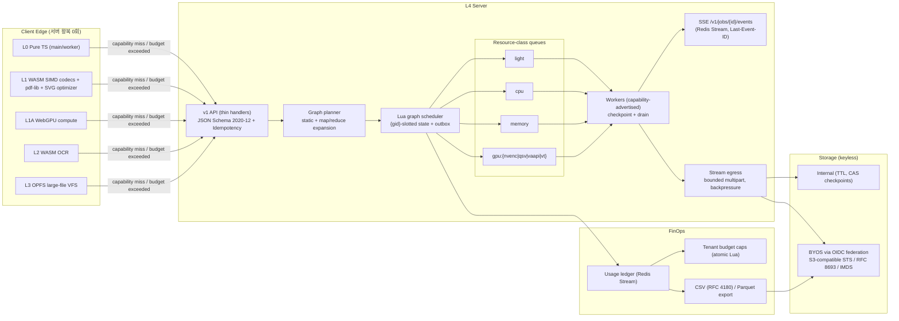

# EasyConvert 차세대 고도화 실행 계획서 v3 — 적대적 감사 결과와 Wave 7~13

> **대상 커밋**: `main @ 8dc1c8e` (2026-10-04 기준, Wave 0~6 병합 완료 시점)
> **문서 성격**: 실행 정본(SSOT). [`EXECUTION_PLAN_V2.md`](./EXECUTION_PLAN_V2.md)의 §0 실행 프로토콜·§0.4 금지 사항·§12 결정 D1~D12를 그대로 승계하고, 이 문서는 Wave 7 이후만 정의한다.
> **감사 방법**: 저장소 코드를 4개 영역(오케스트레이션·스토리지 I/O / 문서·OCR / 미디어·CAD·RAW / 엣지·개발자 플랫폼·샌드박스·테스트넷)으로 나눠 정적 정독했고, 헤드라인 결함은 리드가 해당 라인을 다시 열어 재확인했다. **바이너리 실행 검증은 하지 않았다.** "추정"으로 표시한 항목은 각 WP의 첫 단계에서 실패 테스트로 재현해 확정한다.
> **표기 원칙**: 외부 상용 제품명·타 서비스명은 쓰지 않는다. 요구사항은 국제 표준 규격(ISO/IEC, ITU, RFC, W3C, SMPTE, ETSI, Khronos, KS)과 "상용 엔터프라이즈 변환 서비스 표준"이라는 도메인 용어로만 기술한다. 오라클 도구(poppler, qpdf, ffprobe 등)는 V2와 같이 검증 도구로만 언급한다.

---

## 0. 결론 요약 (Executive Summary)

1. **신규 기능보다 회귀 복구가 먼저다.** Wave 0~6에서 "완료"로 보고된 기능 중 최소 9건이 실제 실행 경로에서 동작하지 않거나 fail-open이다. 대표적으로 **Redis 모드의 DAG 노드 잡이 어떤 워커도 읽지 않는 키에 적재**되고(§2 F-01), **HLS/DASH 패키징 출력에 오디오가 빠지며**(F-04), **PDF/A 변환이 실패해도 원본을 PDF/A라고 반환**한다(F-06). Wave 7(무결성 회귀 복구)을 끝내기 전에는 Wave 8 이후를 시작하지 않는다.
2. **"완비"로 보고된 검증망의 일부는 자기 자신과 비교하는 순환 구조다.** PDF 차분 오라클 E2E는 같은 바이트를 두 번 넣고(`verifyPdfFidelityWithOracle(pdfBytes, pdfBytes, …)`), "2GB 소크"는 합성 스트림의 SHA-256만 계산한다. 엔진은 거치지 않는다(F-12, F-13).
3. **요구사항 중 일부는 표준·런타임 현실과 맞지 않아 재정의한다**(§7): 커널 `splice`/`vmsplice`는 Node.js 코어에 없으므로 "디스크를 거치지 않는 스트림 egress"로 재정의한다. WebP2는 동결된 비트스트림 규격이 없어 제외한다. "0ms 대기"는 측정 불가능한 표현이므로 "서버 왕복 0회"로 바꾼다. "100% 바이너리 보존"은 "미해석 레코드 바이트 동일 보존 + 해석 레코드 의미 동등"으로 바꾼다.
4. 신규 역량(동적 맵-리듀스, 체크포인트 재개, 키리스 BYOS, HDR/공간 음향, IFC/glTF, ACES, Document AI, 엣지 WASM, SDK 무인 배포, 테넌트 FinOps, 카오스 테스트넷)은 Wave 8~13의 **33개 WP**로 분해했다. 모든 WP에는 독립 오라클과 결정론적 게이트를 붙였다.

---

## 1. Ground-Truth 정정표 (보고된 상태 → 검증된 사실)

| # | 보고된 상태 | 검증된 사실 (근거) | 조치 |
|---|---|---|---|
| T1 | 정적 DAG 오케스트레이션 안정화 | 인메모리 모드에서만 동작한다. Redis 모드의 `graphScheduler`는 옵션 없이 생성돼 `keyPrefix 'bull:'`을 쓴다 (`src/lib/queue/graph/scheduler.ts:28-38`, `redis-scheduler.ts:37`). 반면 엔진은 `'easyconvert:queue:'`를 쓴다 (`bullmq-engine.ts:1292,1302`). 그래프 Lua는 대기 키에 `RPUSH`하지만 엔진의 대기 키는 ZSET이다 (`lua-scripts.ts:82,157` vs `bullmq-engine.ts:993`). | WP-70 |
| T2 | DAG 검증기 단일화 | 검증기가 두 벌 있다: `src/lib/jobs/graph.ts`(라우트가 사용)와 `src/lib/queue/graph/validate-graph.ts`(스케줄러 쪽). 1,422줄짜리 `jobs/graph-executor.ts`는 헬퍼 2개를 빼면 사용되지 않는다. op 이름도 `op`/`operation`, `archive.create`/`archive/create`로 이중 표기된다 (`v1/jobs/route.ts:371-376`). | WP-70 |
| T3 | BYOS 어댑터 (S3/GCS/Azure/SFTP/WebDAV) | S3 어댑터는 네트워크 I/O를 하지 않는다. `S3CompatibleStorage`의 모든 연산이 `LocalFsStorage` 스풀로 간다 (`s3-compatible-storage.ts:90-125`). 고객의 `secretAccessKey`는 받기만 하고 쓰지 않는다. presign은 SigV4처럼 보이는 자체 HMAC 문자열이다 (`:137-152`). | WP-77 (security) |
| T4 | HLS/DASH 패키징 | `probeAudioChannels(inputPath, ffmpegBin)`가 ffprobe 자리에 ffmpeg 경로를 넘긴다 (`media-ffmpeg-args.ts:865`). 예외가 0으로 삼켜져 `hasAudio=false`가 되고, 그 결과 **오디오가 없는 패키지**가 만들어진다. 같은 결함 때문에 7.1 다운믹스가 5.1 행렬로 처리된다 (`:701`). | WP-71 |
| T5 | PDF/A 지원 | 입력과 출력 경로가 같다 (`pdf-postprocess/pdfa.ts:77-78`). 그래서 `existsSync(outputPdf)`가 항상 참이고, 변환 실패 시 원본 바이트를 PDF/A로 반환한다. veraPDF JSON 파싱 경로도 실제 리포트 구조와 다를 가능성이 높다 (추정). | WP-72 |
| T6 | 제로트러스트 샌드박스 | `docker/seccomp-airgap.json`은 compose와 Dockerfile 어디에서도 참조되지 않는다. compose의 `STRICT_SANDBOX=true` + `cap_drop: ALL` 조합에서는 비특권 `unshare`가 거부돼 네이티브 엔진 잡이 전부 실패할 수 있다 (추정, `process-sandbox.ts:325-345,527-536`). `worker-gpu` 서비스에 `WORKER_QUEUES`가 없어 CPU 워커도 gpu 큐를 소비한다. | WP-78 (infra) |
| T7 | Wang et al. MSSIM 차분 오라클 | MSSIM 구현(11×11 가우시안, σ=1.5) 자체는 맞다 (`tests/oracles/product/pdf-oracle.ts:49-153`). 그러나 E2E 테스트가 같은 PDF를 자기 자신과 비교한다 (`product-differential-oracles.test.ts:138-140`). VRT는 같은 SVG를 sharp로 두 번 렌더링해 SSIM 1.0을 단언한다. `vrt-engine.ts:181`은 윈도 없는 전역 SSIM이다. | WP-75 |
| T8 | 2GB 소크 테스트넷 | `run-endurance-soak.ts`는 `transformEngine` 없이 합성 스트림을 SHA-256 패스스루한다. 엔진, Redis, 워커는 모두 미경유다. 소크 워크플로에는 tesseract/unrar/qpdf가 설치되지 않는다. | WP-173 |
| T9 | 하이브리드 5계층(L0~L4) | 코드상 계층은 **6개**다: `'L0'|'L1'|'L1A'|'L2'|'L3'|'L4'` (`edge/tier-router.ts:18`). `.wasm` 산출물은 없다. WASM은 base64로 인라인된 4개 함수짜리 장난감 커널뿐이다 (`edge/workers/simd-bytecode.ts`). COOP/COEP 헤더가 없어 `crossOriginIsolated`가 항상 거짓이다 (`next.config.mjs`). | WP-150~152 |
| T10 | 다언어 SDK | TS/Python 2종뿐이다. `scripts/generate-sdk.ts`는 OpenAPI를 읽지 않고 하드코딩된 템플릿 문자열을 출력하므로 명세와 드리프트한다. 게시 워크플로는 없다. | WP-160 |
| T11 | 카메라 RAW → DNG | 레지스트리는 RAW 계열 타깃에 `dng`를 광고하지만 (`registry.ts:1606` 외), `convertImage`에 `case 'dng'`가 없어 `Unsupported image target format`으로 실패한다. | WP-72 (광고 철회), WP-133 (구현) |
| T12 | EPUB 양방향 | 리더가 OPF spine을 무시하고 ZIP 키 순서로 읽는다 (`office.ts:7258`). EPUB→mobi/azw3/rtf/lrf/oeb/pdb는 광고만 있고 엔진이 없다. 라이터는 모든 책에 고정 식별자 `urn:uuid:easyconvert-book`과 `lang="en"`을 쓴다 (`office.ts:8372,8395`). | WP-72, WP-103 |

---

## 2. 결함 레지스터 (신규 발견, 심각도순)

| ID | 심각도 | 결함 | 근거 | WP |
|---|---|---|---|---|
| F-01 | **Critical** | Redis 모드 DAG 노드 잡 고아화: 키 prefix 불일치 + LIST/ZSET 타입 충돌(WRONGTYPE) + 한 EVAL이 `{gid}`와 `{easyconvert-jobs}` 두 해시 태그를 건드림(Redis Cluster에서 CROSSSLOT) | T1 | WP-70 |
| F-02 | **Critical** | `NODE_COMPLETED`가 노드 중복 완료를 막지 않음. `completedNodes`가 두 번 증가하고 자식 in-degree가 음수가 될 수 있음 → 그래프가 조기 완료됨 | `lua-scripts.ts:121-141` | WP-70 |
| F-03 | High | `processGraphNodeJob`이 **매 시도마다** `onNodeFailed`를 호출함. `fail_fast`에서는 첫 일시 오류로 그래프 전체가 실패해 재시도가 무의미해짐 | `node-executor.ts:505` | WP-70 |
| F-04 | High | HLS/DASH 오디오 누락, 7.1 다운믹스 오판 | T4 | WP-71 |
| F-05 | High | `export.url`이 `res.ok`를 확인하지 않음 → 외부 업로드 실패가 성공으로 집계됨. 입력 전체를 `Buffer`로 적재함 | `node-executor.ts:445-458` | WP-70 |
| F-06 | High | PDF/A fail-open | T5 | WP-72 |
| F-07 | High | 엣지 OCR이 Tesseract 실패를 `catch {}`로 삼키고, 텍스트 없는 PDF를 L2 성공으로 보고함. 사용되지 않는 `public/workers/edge-ocr.worker.js`는 CDN에서 스크립트를 내려받고, 실패 시 **파일명을 OCR 텍스트로 지어냄** | `edge-ocr/index.ts:148`, `public/workers/edge-ocr.worker.js` | WP-74 |
| F-08 | High | 그래프 잡이 사실상 이중 적재됨: 일반 잡(`graph` 포함)으로 한 번, `initGraph`로 한 번 | `v1/jobs/route.ts:549,582`, `node-processor.ts:161` | WP-70 |
| F-09 | High | `targetFormat`이 없으면 조용히 `'pdf'`로 기본값을 넣음 (fail-open) | `v1/jobs/route.ts:380` | WP-70 |
| F-10 | High | HWP5 TABLE 레코드를 잘못 해석함: rows/cols를 offset 2/4에서 읽지만 규격은 offset 0이 UINT32 속성, 4가 rows, 6이 cols다. 테이블이 레코드 레벨로 닫히지 않음. 확장 컨트롤 문자(8 WCHAR)의 뒤쪽 7유닛이 본문으로 새어 나감 | `hwp.ts:398,695,744-745` | WP-73 |
| F-11 | High | HEVC `main10` 프로파일을 허용하면서 `-pix_fmt yuv420p`를 강제함 → 10비트 PQ/HLG 입력이 톤매핑 없이 8비트로 잘림 | `media-ffmpeg-args.ts:97,500-501` | WP-71 |
| F-12 | High (테스트) | PDF 차분 오라클과 VRT의 자기 비교 | T7 | WP-75 |
| F-13 | Medium (테스트) | 소크가 합성 스트림만 처리함. `test:redis` 단계에 `ORACLE_STRICT_MODE`가 없음. 퍼징이 시드 없는 `Math.random`이라 재현 불가. anti-cheat baseline이 위반 112건(약한 단언 111, 잘라내기 1)을 허용 중 | T8, `scripts/anti-cheat-baseline.json` | WP-75 |
| F-14 | Medium | TUS 만료 시 Redis 키만 삭제하고 `.bin`/`.info` 고아 파일은 남김. 세션 락이 프로세스 로컬 `Map`임. presigned 세션도 프로세스 로컬이라 다중 레플리카에서 깨짐 | `tus-engine.ts:237`, `s3-storage.ts:48` | WP-81 |
| F-15 | Medium | 자격증명 볼트: 단일 마스터 키, 키 버전·회전 없음, 개발 모드는 상수 salt, `JWT_SECRET`으로 폴백 | `credentials-vault.ts:~100-190` | WP-92 (security) |
| F-16 | Medium | `usage-ledger.clear()`가 `redis.keys()`를 사용함 (O(N), 운영에서 블로킹) | `quota/usage-ledger.ts:192` | WP-164 |
| F-17 | Medium | EXR에 `chromaticities` 속성이 없음 → 광색역 선형 데이터가 무태그로 출력됨. ICC TRC가 실제 인코딩 곡선과 불일치(γ2.2 vs sRGB 구간 곡선). 8비트 출력에는 ICC를 넣지 않음 | `raw-hdr.ts:890,1433` | WP-130 |
| F-18 | Medium | DNG 색 처리 순서: WB가 적용된 데이터에 ColorMatrix 역행렬을 곱함. CCT를 AsShotNeutral에서 유도하지 않고 기본 5500K를 씀 | `raw-hdr.ts:509-547` | WP-130 |
| F-19 | Medium | 리소스 클래스 무시: Redis 모드는 모든 노드를 기본 큐로 보냄. `resolveResourceClass`는 GPU 유무와 무관하게 모든 비디오를 gpu로 보냄 | `redis-scheduler.ts:95-109`, `resource-class.ts:111-121` | WP-70, WP-113 |
| F-20 | Low (거버넌스) | 외부 서비스 화면을 스크래핑하는 스크립트 7개와 결과 JSON이 추적되고 있음. 내장 모듈 import 10건에 `node:` 접두사가 없음. V2 문서 끝에 다른 세션의 프롬프트 잔재가 붙어 있었음(본 PR에서 제거) | `scripts/inspect-*.mjs`, `scripts/subpages-inspection-result.json` | WP-76 |
| F-21 | Low (구조) | SRP 위반: `office.ts` 9,693줄, `cad-nurbs.ts` 5,085줄, `bullmq-engine.ts` 2,529줄. "얇은 API 핸들러" 원칙 위반: `v1/jobs/route.ts` 680줄, `openapi.json/route.ts` 1,011줄 | `wc -l` | 각 도메인 WP에서 터치하는 부분만 분리 (빅뱅 리팩터링 금지) |

---

## 3. 요구사항별 갭 매트릭스

상태 표기: ✅ 존재 / 🟡 부분 / ❌ 부재

### 3.1 초대규모 오케스트레이션 · I/O

| 요구사항 | 현재 | 기준 규격·모범 사례 | 갭 | WP |
|---|---|---|---|---|
| 동적 맵-리듀스 DAG | ❌ 정적 32노드, fan-out 16, 깊이 8 | 런타임 자식 생성 + 결정론적 reduce, 결과 순서 보존 | `map`/`reduce` op 없음. PDF 페이지 분할, 미디어 타임슬라이스, 아카이브 엔트리 분할 없음 | WP-80 |
| 체크포인트·부분 재개 | 🟡 중간 산출물 24h TTL 보존 | 콘텐츠 주소 지정(SHA-256) 체크포인트, 실패 서브그래프만 재실행 | 재개 API 없음, 노드 멱등성 없음 | WP-81 |
| Saga 보상 | 🟡 중간 산출물 삭제, 쿼터 롤백 | 보상 가능/피벗/재시도 가능 단계 구분 | multipart abort, `export.url` 보상 의미 정의 없음 | WP-81 |
| 테넌트 공정성·잡별 동시성 | ❌ 워커 전역 동시성만 있음 | 가중 공정 큐잉(WFQ) | 잡·테넌트 단위 상한 없음 | WP-82 |
| 키리스 BYOS | ❌ 정적 키만 있음 | OIDC 웹 아이덴티티(`AssumeRoleWithWebIdentity`), RFC 8693 토큰 교환, IMDS 관리형 아이덴티티 | 페더레이션 전무, S3 어댑터 자체가 가짜(T3) | WP-90, 91 |
| 디스크 미경유 egress | ❌ 임시파일 → 복사 → `readFileSync` | 자식 stdout → 유한 버퍼 multipart, 비동기 백프레셔 | 파트 업로드 대기·동시성 상한 없음 | WP-83 |

### 3.2 초고충실도 엔진

| 도메인 | 요구사항 | 현재 | 기준 규격 | WP |
|---|---|---|---|---|
| PDF | PDF/UA-1/2 태그 구조 | ❌ (StructTreeRoot/MarkInfo/Lang 흔적 0) | ISO 14289-1/-2, Matterhorn Protocol | WP-100 |
| PDF | PDF/X-4 | ❌ | ISO 15930-7 (OutputIntent, TrimBox/BleedBox) | WP-101 |
| PDF | PDF/A 레벨 확장·검증 | 🟡 1b/2b/3b, fail-open | ISO 19005-2/-3/-4 (a/u 레벨, XMP `pdfaid`) | WP-72, WP-102 |
| EPUB | 3.3 양방향, 고정 레이아웃 | 🟡 단일 챕터 텍스트 | W3C EPUB 3.3, EPUB Fixed Layout, CSS Paged Media | WP-103 |
| OOXML | OMML→MathML, SmartArt, 차트, 임베디드 객체 | 차트 ✅ / SmartArt 🟡(PPTX만) / OMML ❌ / OLE ❌ | ECMA-376 Part 1 §22.1, W3C MathML 3/4 | WP-104 |
| ODF | 1.3 무결성 | 🟡 텍스트·표 수준 | OASIS ODF 1.3 (ISO/IEC 26300) RELAX NG | WP-104 |
| HWP | HWPX/HWP5 표 내 OLE, 다단, 각주·미주, 글자 겹침 | 🟡 결함 다수(F-10), HWPX 정규식 파서 | KS X 6101 (OWPML), HWP 5.0 공개 규격 | WP-73, WP-105 |
| 비디오 | AV1 / VVC / JPEG XL / WebP2 | AV1 🟡(인코더 불일치) / VVC ❌ / JXL ❌ / WebP2 ❌ | AOM AV1, ITU-T H.266, ISO/IEC 18181 | WP-111 (WebP2 제외 §7) |
| HDR | HDR10/HDR10+/동적 메타데이터, 톤매핑 | ❌ 탐지조차 없음 | SMPTE ST 2084, ARIB STD-B67, ST 2086, ST 2094-10/-40, ITU-R BT.2020/BT.2390/BT.2408 | WP-110 |
| 오디오 | 16ch 앰비소닉스, E-AC-3 JOC 패스스루, 다국어 트랙, 다중 WebVTT | ❌ 패스스루 없음, 채널 1/2/6/8만, 자막 단일 | ETSI TS 102 366, ETSI TS 103 420, AmbiX(ACN/SN3D), ISO 639-2, W3C WebVTT, RFC 8216 EXT-X-MEDIA | WP-112 |
| 하드웨어 가속 | 큐 분리·폴백 매트릭스 | 🟡 인코더 탐지만, 런타임 폴백 없음 | — | WP-113 |
| BIM | IFC4/IFC4.3 → glTF/USDZ | ❌ | ISO 16739-1:2024, Khronos glTF 2.0 (ISO/IEC 12113), USDZ | WP-120~122 |
| CAD | 크랙 없는 테셀레이션, HLR 2D 투영 | 🟡 패치 간 용접 없음 / HLR ❌ | ISO 10303-42 해석 곡면 | WP-123, 124 |
| 3D 자산 | PBR, Draco, KTX2/Basis | ❌ | `KHR_materials_*`, `KHR_draco_mesh_compression`, `KHR_texture_basisu`, KTX 2.0 | WP-121 |
| 컬러 | ACES 작업 색공간, IDT/ODT | ❌ | SMPTE ST 2065-1/-4, S-2014-004(ACEScg), S-2016-001(ACEScct) | WP-131 |
| RAW | 노이즈 프로파일 웨이블릿 디노이즈, 모아레 | 디노이즈 ❌ / 위색 억제 ✅ | DNG 1.7 NoiseProfile(51041) | WP-132 |
| Document AI | 표 구조 인식(span, 무테두리) | ❌ (타입만 있고 할당 0) | TEDS 지표, HTML `rowspan/colspan` | WP-140 |
| Document AI | 수식 OCR → LaTeX | ❌ | LaTeX / KaTeX 파싱 가능성 | WP-141 |
| Document AI | LLM-Ready 의미론적 청킹 | ❌ (제목이 전부 `##`) | JSON Schema 2020-12 청크 계약, H1~H6 계층, 출처 bbox | WP-142 |

### 3.3 L0/L1 엣지 · 개발자 플랫폼 · 하드웨어 · 카오스

| 요구사항 | 현재 | WP |
|---|---|---|
| WASM SIMD 이미지 코덱(WebP/AVIF), SVG 최적화, PDF 분할·병합 | 캔버스 기반 PNG/JPG/WebP/BMP만. AVIF·SVG 최적화·PDF 분할 ❌ | WP-151 |
| COOP/COEP, SharedArrayBuffer | ❌ | WP-150 |
| 엣지↔서버 출력 패리티 증명 | ❌ (손계산 픽셀, 자기 디코더 왕복) | WP-152 |
| OpenAPI 3.1 기반 5개 언어 SDK 무인 게시 | 🟡 3.1 명세 ✅, SDK는 템플릿 2종 | WP-160 |
| SSE/WebSocket 실시간 진행률 | 🟡 레거시 `/api/queue/jobs/[id]` SSE만, v1 ❌, 재개 ❌ | WP-161 |
| gRPC/Protobuf | ❌ | WP-162 (스키마 SSOT만, 서버는 결정 D-24) |
| 테넌트·서브계정·예산 상한, Parquet/CSV 원장 내보내기 | ❌ (사용자 단위 일일 한도만) | WP-163 |
| 하드웨어 큐 분리·소프트웨어 폴백 매트릭스 | 🟡 | WP-113 |
| 카오스(워커 SIGKILL, Redis 장애, TUS 단절) | 🟡 단위 수준만 | WP-170 |
| 외부 상용 렌더러 기준 덤프 교차 차분 | ❌ | WP-171 |

---

## 4. 목표 아키텍처

**설계 불변식**
- I1. 그래프 상태 키는 모두 `{gid}` 해시 태그 하나에 모은다. 큐 적재는 같은 EVAL에서 하지 않는다. `graph:{gid}:outbox`에 기록한 뒤 별도 단계에서 큐 슬롯으로 옮긴다(트랜잭셔널 아웃박스). 그래야 클러스터 CROSSSLOT이 원천 차단된다.
- I2. 노드 완료는 `(gid, nodeId, attemptToken)` 기준으로 멱등이다. 같은 노드가 두 번 완료되면 두 번째는 no-op이다.
- I3. 체크포인트는 출력 SHA-256으로 주소를 지정한다(`cas/{sha256}`). 재개할 때 다이제스트가 일치하는 노드는 재실행하지 않는다.
- I4. 모든 폴백(엔진·HW·엣지→서버)은 결과 메타데이터 `engineFallback{from,to,reason}`에 기록한다. 조용한 폴백은 금지한다(V2 §0.4 승계).

---

## 5. Wave / WP 총괄표

> 위험 분류가 **security**·**infra**·**migration**인 WP는 단독 PR로만 진행한다(CLAUDE.md "Do not split …" 규칙).

| Wave | WP | 제목 | 위험 | 의존 | 결정 |
|---|---|---|---|---|---|
| **7** | WP-70 | DAG 실행 경로 정합 (F-01·02·03·05·08·09·19, 검증기 SSOT) | orchestration | — | — |
| 7 | WP-71 | 미디어 fail-open (F-04, F-11) | engine | — | — |
| 7 | WP-72 | 문서 fail-open (F-06), 광고-엔진 정합 게이트 (T11, T12) | engine | — | — |
| 7 | WP-73 | HWP5 레코드 정합 (F-10) | engine | — | D-14 |
| 7 | WP-74 | 엣지 fail-open (F-07) | engine | — | — |
| 7 | WP-75 | 테스트 무결성 3차 (F-12, F-13) | test | — | — |
| 7 | WP-76 | 거버넌스 정리 (F-20) | chore | — | — |
| 7 | WP-77 | BYOS S3 어댑터 실구현 또는 비활성화 + 실 SigV4 (T3) | **security** | — | D-15 |
| 7 | WP-78 | seccomp 연결, strict 샌드박스 컨테이너 실증, gpu 큐 소비 분리 (T6) | **infra** | — | — |
| **8** | WP-80 | 동적 맵-리듀스 (`map`/`reduce` op, 아웃박스) | orchestration | WP-70 | D-16 |
| 8 | WP-81 | CAS 체크포인트, 서브그래프 재개, Saga 보상, 업로드 세션 공유화 (F-14) | orchestration | WP-80 | — |
| 8 | WP-82 | 테넌트 가중 공정 큐잉, 잡별 동시성 | orchestration | WP-70 | — |
| 8 | WP-83 | 디스크 미경유 스트림 egress | storage | WP-70, WP-77 | D-17 |
| **9** | WP-90 | S3 호환 OIDC 웹 아이덴티티 페더레이션 | **security** | WP-77 | D-15 |
| 9 | WP-91 | RFC 8693 토큰 교환(gcs) + IMDS 관리형 아이덴티티(azure-blob) | **security** | WP-90 | D-15 |
| 9 | WP-92 | 볼트 키 버전·봉투 암호화·회전 (F-15) | **security** | — | D-18 |
| **10** | WP-100 | 태그드 PDF / PDF/UA-1 | engine | WP-72 | D-19 |
| 10 | WP-101 | PDF/X-4 | engine | WP-100 | D-19 |
| 10 | WP-102 | PDF/A-2u/3u/4, OutputIntent, XMP 검증 | engine | WP-72 | D-19 |
| 10 | WP-103 | EPUB 3.3 (spine, 다중 챕터, 고정 레이아웃) | engine | WP-72 | D-20 |
| 10 | WP-104 | OOXML OMML→MathML, SmartArt, OLE 대체 이미지, ODF 1.3 | engine | — | — |
| 10 | WP-105 | HWPX DOM 파서, HWP5 각주·다단·OLE·글자 겹침 | engine | WP-73 | D-14 |
| 10 | WP-110 | HDR 탐지·보존·톤매핑 | engine | WP-71 | D-21 |
| 10 | WP-111 | 코덱: AV1 통일, JPEG XL, VVC(결정 후) | engine | WP-71 | D-21 |
| 10 | WP-112 | 공간 음향·다국어 트랙·다중 자막·CMAF 그룹 | engine | WP-71 | — |
| 10 | WP-113 | HW 가속 능력 광고·큐 라우팅·명시적 SW 폴백 | infra | WP-78 | — |
| 10 | WP-120 | IFC4/IFC4.3 리더 | engine | — | D-22 |
| 10 | WP-121 | glTF 2.0/GLB 라이터 (PBR, Draco, KTX2) | engine | WP-120 | D-22 |
| 10 | WP-122 | USDZ 라이터 | engine | WP-121 | D-22 |
| 10 | WP-123 | 엣지 우선 테셀레이션 (크랙 0) + 해석 곡면 | engine | — | D9 |
| 10 | WP-124 | HLR 2D 투영 → SVG/PDF | engine | WP-123 | D9 |
| 10 | WP-130 | DNG 색 정합 + ICC/EXR 태깅 (F-17, F-18) | engine | — | D10 |
| 10 | WP-131 | ACES 파이프라인 (AP0/AP1, ST 2065-4 EXR) | engine | WP-130 | D-23 |
| 10 | WP-132 | 노이즈 프로파일 웨이블릿 디노이즈 | engine | WP-130 | — |
| 10 | WP-133 | DNG 라이터 | engine | WP-130 | D10 |
| 10 | WP-140 | 표 구조 인식 (span, 무테두리) | engine | — | — |
| 10 | WP-141 | 수식 영역 탐지 + LaTeX 인식 | engine | WP-140 | D-25 |
| 10 | WP-142 | RAG 청킹 내보내기 | engine | WP-140 | — |
| **11** | WP-150 | COOP/COEP + 교차 출처 격리 | **security** | — | — |
| 11 | WP-151 | 실 WASM 코덱 / SVG 최적화 / PDF 분할·병합 엣지화 | engine | WP-150 | D-26 |
| 11 | WP-152 | 엣지 패리티 E2E (브라우저 실행) | test | WP-151 | — |
| **12** | WP-160 | 명세 구동 5개 언어 SDK + 게시 파이프라인 | dx (게시 시크릿은 infra PR 분리) | — | D1, D-27 |
| 12 | WP-161 | v1 SSE 진행률 스트림 | api | WP-70 | D-24 |
| 12 | WP-162 | Protobuf 이벤트 스키마 SSOT (서버는 보류) | api | WP-161 | D-24 |
| 12 | WP-163 | 테넌트·서브계정·예산 상한·원장 내보내기 | **migration** | WP-82 | D3, D-28 |
| 12 | WP-164 | 원장 O(N) 키 스캔 제거 (F-16) | api | — | — |
| **13** | WP-170 | 카오스 테스트넷 | test | WP-81, WP-78 | D-29 |
| 13 | WP-171 | 외부 기준 렌더러 교차 차분 망 | test | WP-75 | D-30 |
| 13 | WP-172 | 시드 고정 + 커버리지 유도 퍼징 | test | WP-75 | — |
| 13 | WP-173 | 실파이프라인 2/5/10 GiB 소크 | test | WP-83 | — |

---

## 6. WP 상세 명세

> 각 WP의 공통 DoD는 V2 §0.2(guard → lint → tsc → 대상 테스트 → 전체 테스트 → build)에 §8 게이트를 더한 것이다. "실패 테스트 선행"은 버그 수정 WP의 필수 첫 커밋이다(CLAUDE.md "Bug fixes start with a failing regression test").

### Wave 7 — 무결성 회귀 복구 (신규 기능 금지)

#### WP-70 DAG 실행 경로 정합
- **목표**: Redis 모드에서 다이아몬드/팬아웃 그래프가 실제 `Worker`에 의해 끝까지 실행되게 한다.
- **변경**
  - `src/lib/queue/graph/scheduler.ts`, `redis-scheduler.ts`: 엔진과 같은 prefix와 리소스 클래스 큐 이름을 쓰도록 엔진 인스턴스에서 주입한다. 상수는 `bullmq-engine.ts`에서 export한 단일 출처를 쓴다.
  - `lua-scripts.ts`: 큐 적재를 아웃박스(I1)로 옮기고 ZSET 점수 공식(`priorityRank*1e12+ts`)을 공유한다. `NODE_COMPLETED`/`NODE_FAILED`에 상태 가드를 넣는다(I2).
  - `node-executor.ts`: 최종 시도에서만 `onNodeFailed`를 호출한다. `export.url`은 `res.ok`가 아니면 typed error를 던지고, 본문은 스트림으로 보낸다.
  - `src/app/api/v1/jobs/route.ts`: 이중 적재를 제거하고(그래프면 `initGraph`만 호출), `'pdf'` 기본값(F-09)을 제거해 400을 반환한다. op 이름은 정규형 하나로 정하고, 레거시 별칭은 검증 단계에서 정규화한 뒤 경고 헤더를 단다. 라우트 로직은 `src/lib/jobs/submit-job.ts` 파사드로 이동한다.
  - 검증기 SSOT: `src/lib/queue/graph/validate-graph.ts` 하나만 남긴다. `src/lib/jobs/graph.ts`는 타입 재수출만 하고, `src/lib/jobs/graph-executor.ts`의 사용 중인 헬퍼 2개는 `src/lib/queue/graph/artifacts.ts`로 옮긴 뒤 원본을 삭제한다.
- **수용 기준 / 오라클**
  - `tests/job-graph-redis-e2e.test.ts`(신규, 실제 Redis): 4노드 다이아몬드와 1→8 팬아웃을 실제 `Worker` 2개로 실행한다. 모든 노드가 정확히 1회 실행돼야 한다(실행 카운터는 테스트가 독립적으로 집계). 최종 출력은 pdfinfo 페이지 수와 7z 목록으로 확인한다.
  - 중복 완료 주입: `NODE_COMPLETED`를 같은 토큰으로 2회 호출해도 `completedNodes`와 자식 in-degree가 변하지 않는다.
  - 일시 오류 1회 후 성공 시나리오: `fail_fast` 그래프가 완료 상태로 끝난다.
  - Redis Cluster 해시 슬롯: 모든 그래프 EVAL의 KEYS가 같은 슬롯이어야 한다. CRC16은 테스트 헬퍼에서 독립 구현한다.
- **검증**: `npm run test:redis` (CI에서 `ORACLE_STRICT_MODE=1`), 대상 테스트, `/verify`.

#### WP-71 미디어 fail-open
- **변경**: `media-ffmpeg-args.ts`에서 `probeAudioChannels`가 ffprobe만 받도록 시그니처를 좁힌다(ffmpeg 경로 전달은 컴파일 에러가 되게 브랜드 타입 사용). 프로브 실패는 0으로 삼키지 않고 throw한다. 10비트 프로파일이면 `yuv420p10le`를 쓰고, 8비트로 강제할 때는 HDR 입력을 거부한다(톤매핑은 WP-110). HW 인코딩 런타임 실패 정책은 WP-113 전까지 typed error로 둔다.
- **오라클**: 실제 ffmpeg 산출물에 대해
  - ffprobe로 HLS/DASH 각 렌디션의 오디오 스트림 수가 1 이상인지 확인한다.
  - 7.1 테스트 톤(채널별 주파수 분리)을 BS.775 다운믹스한 결과를 FFT 대역 에너지로 검증한다. FFT는 테스트 헬퍼에 독립 구현한다.
  - main10 출력은 ffprobe `pix_fmt=yuv420p10le`, `profile=Main 10`이어야 한다.

#### WP-72 문서 fail-open + 광고-엔진 정합 게이트
- **변경**
  - `pdf-postprocess/pdfa.ts`: 출력 디렉터리를 분리하고 출력 바이트가 입력과 같으면 실패로 처리한다. veraPDF 리포트 파서를 실제 스키마에 맞추되, 결과 해석은 테스트에서 고정 픽스처 리포트로 검증한다.
  - `registry.ts`: 엔진 경로가 없는 광고 타깃(RAW→dng, EPUB→mobi/azw3/rtf/lrf/oeb/pdb)을 철회한다.
  - EPUB 라이터: 식별자는 `crypto.randomUUID()`, 언어는 입력의 `lang`(없으면 `und`)으로 한다.
- **신규 게이트**: `tests/registry-engine-conformance.test.ts`. 레지스트리의 모든 (source,target) 쌍마다 최소 입력 픽스처로 변환을 시도한다. `Unsupported … target` 류 오류가 0건이어야 하며, 도구가 없어 skip된 쌍은 목록으로 출력한다. 쌍마다 출력 매직 넘버를 검증한다. 이 게이트로 "광고만 있고 엔진이 없는" 회귀를 영구 차단한다.
- **오라클**: qpdf `--check`, XMP `pdfaid:part/conformance`를 독립 XML 파서로 확인한다. veraPDF는 CI 선택 잡이고 결정 D6을 승계한다.

#### WP-73 HWP5 레코드 정합
- **변경** (`hwp.ts`)
  - TABLE은 offset 0 UINT32 속성, 4 rows, 6 cols로 읽는다.
  - 레코드 level 스택으로 컨트롤 중첩을 관리한다.
  - 확장/인라인 컨트롤 문자는 8 WCHAR 단위로 건너뛴다.
  - 섹션은 숫자로 정렬한다.
- **오라클**: 자체 빌더(`buildHwpCompoundFile`)가 만든 픽스처는 순환이므로, 이를 대체하는 **외부 저작 도구로 만든 공개 라이선스 HWP 골든 세트**(D-14)와 손으로 작성한 기대 텍스트·표 구조 JSON을 쓴다. 독립 CFB 파서(`olefile` 계열 CLI, D-14)로 스트림 목록을 대조한다.

#### WP-74 엣지 fail-open
- `edge-ocr/index.ts`: OCR 실패 시 L4로 명시적 폴백하고 `engineFallback`을 기록한다. 기본 신뢰도 상수 `0.92`를 제거한다.
- `public/workers/edge-ocr.worker.js`: 삭제한다(미사용, CDN 로드, 파일명 날조).
- **오라클**: Playwright(Chromium 사전 설치) E2E에서 Tesseract 로드를 강제로 실패시킨다. 이때 `/api/convert` 요청이 정확히 1회 발생하고, 텍스트가 빈 성공 결과는 0건이어야 한다.

#### WP-75 테스트 무결성 3차
- `product-differential-oracles.test.ts`: 제품 엔진 출력(LibreOffice 또는 `office.ts` PDF 경로)과 독립 렌더러 결과를 비교하도록 교체한다.
- `phase-4-vrt-visual-regression.test.ts`: 기준 이미지는 독립 래스터라이저(ImageMagick/rsvg 계열)로 만든다.
- `vrt-engine.ts`의 전역 SSIM을 제거하고 MSSIM 하나로 통일한다.
- `ci.yml`의 `test:redis` 단계에 `ORACLE_STRICT_MODE=1`을 추가한다.
- 퍼징 시드를 고정하고 실패 시 시드를 출력한다.
- **ratchet 계획**: baseline 112건을 이 WP에서 최소 30% 감축하고, 이후 각 도메인 WP가 손대는 파일의 위반은 0으로 만든다. guard에 "baseline 증가 금지" 규칙은 이미 있으므로 감소분만 반영한다.
- **오라클 자체 검증**: `mutation-sensitivity.ts`에 "입력=출력 자기 비교" 탐지 규칙을 추가한다(동일 바이트 비교 시 테스트 실패).

#### WP-76 거버넌스 정리
- 외부 서비스 스크래핑 스크립트(`scripts/inspect-*.mjs` 7개, `capture-*.mjs` 중 외부 URL 사용분)와 `scripts/subpages-inspection-result.json`을 삭제한다.
- 내장 모듈 import 10건에 `node:` 접두사를 붙인다.
- guard에 규칙 G5(외부 서비스 도메인 문자열 탐지)와 G6(`node:` 접두사 누락)을 추가한다.

#### WP-77 BYOS S3 어댑터 (security 단독)
- (a) `S3CompatibleStorage`를 실제 HTTP SigV4 클라이언트로 교체한다. 공식 SigV4 테스트 벡터 스위트로 서명을 검증한다(D4 승계).
- (b) 결정 전까지는 `s3` provider 등록을 **fail-closed로 거부**한다(400 `BYOS_PROVIDER_UNAVAILABLE`).
- **오라클**: CI에서 로컬 S3 호환 서버 컨테이너(클라우드 불필요)에 업로드한 뒤 독립 클라이언트 CLI로 다운로드해 SHA-256을 비교한다. presign URL은 서버가 아닌 독립 HTTP 클라이언트로 접근한다.

#### WP-78 샌드박스 실증 (infra 단독)
- compose와 Dockerfile에 `security_opt: seccomp=docker/seccomp-airgap.json`을 연결한다.
- `scripts/verify-worker-container.sh`(V2 §13)를 CI 컨테이너 잡으로 실행한다. 확인 항목: strict 모드에서 ffmpeg·7z·soffice 각각 1건 변환 성공, 자식 프로세스의 외부 TCP 연결 실패, 부모의 Redis 연결 성공.
- `worker-gpu`에 `WORKER_QUEUES=gpu`를, CPU 워커에 `light,cpu,memory`를 설정한다.
- `docker/AIRGAP.md`의 UID(1001)를 Dockerfile(10001)과 일치시킨다.

### Wave 8 — 초대규모 오케스트레이션

#### WP-80 동적 맵-리듀스
- **스키마** (`queue/graph/types.ts`): 새 op 두 종류를 추가한다.
  - `map`: `{ split: 'pdf.pages' | 'archive.entries' | 'media.segments', chunk: {pages?|entries?|seconds?}, body: SubGraphTemplate }`
  - `reduce`: `{ combine: 'pdf.merge' | 'archive.create' | 'media.concat' | 'json.concat', order: 'index' }`
  - `body`는 정적 검증 가능한 템플릿이며 중첩 `map`은 금지한다(깊이 1).
- **실행**
  - splitter 노드가 매니페스트(`{index, inputKey, sha256}[]`)를 출력한다.
  - Lua `EXPAND_MAP`이 템플릿을 N회 인스턴스화한다. 노드 ID는 `${mapId}#${index}/${tplNodeId}`이다. 아웃박스 적재와 `reduce` in-degree=N 설정을 원자적으로 수행한다.
  - 런타임 상한은 티어별 `MAX_MAP_FANOUT`(D-16, 기본 enterprise 1,024 / pro 256 / free 32)이고, 초과 시 그래프를 `MAP_FANOUT_EXCEEDED`로 실패시킨다(조용한 절단 금지).
- **미디어 타임슬라이스**
  - 분할은 키프레임 경계로만 한다(`-f segment -segment_time` + `-force_key_frames`, closed GOP).
  - 각 세그먼트는 동일 인코더 파라미터로 인코딩한다.
  - `media.concat`은 concat demuxer 스트림 카피로 결합한다.
  - 오디오는 분할하지 않고 원본에서 한 번만 인코딩해 mux한다. AAC 프라이밍 샘플 때문에 경계 클릭이 생기는 것을 막기 위해서다.
- **오라클**
  - 500페이지 PDF를 50페이지씩 맵→래스터화→병합: pdfinfo 페이지 수 500, 페이지별 pdftotext 순서가 원본과 일치해야 한다.
  - 1,000 엔트리 아카이브 맵→zstd→재아카이브: 7z 목록과 엔트리별 CRC가 일치해야 한다.
  - 4K 60초 클립을 10초×6 분할 인코딩 후 결합: ffprobe 총 프레임 수 = 원본 프레임 수, PTS 단조 증가, 경계 프레임 PSNR ≥ 단일 패스 인코딩 대비 −0.5 dB (ffmpeg `psnr` 필터는 독립 오라클).
  - 결정론: 같은 입력을 두 번 실행했을 때 reduce 출력 SHA-256이 같아야 한다(미디어는 `-fflags +bitexact`).

#### WP-81 체크포인트 · 재개 · Saga
- **체크포인트**: 노드 출력을 `cas/{sha256}`에 쓰고, 노드 레코드에 `{inputsDigest, outputsDigest, engineVersion}`를 기록한다. `inputsDigest`가 같고 CAS 객체가 있으면 재실행을 건너뛴다(I3).
- **재개 API**: `POST /api/v1/jobs/{id}/resume`. failed/cancelled 노드와 그 하류만 `pending`으로 되돌린다. 원장에는 재실행 노드만 과금한다.
- **축출 대응**: SIGTERM 드레인 중 진행 중인 미디어 맵 노드는 완료된 세그먼트까지 체크포인트한다. `-f segment` 산출물 단위이므로 별도 인코더 상태 저장은 필요 없다.
- **Saga**: op마다 `compensation` 등급을 선언한다.
  - `retriable`: 변환류.
  - `compensable`: multipart(abort), 내부 저장(delete).
  - `pivot`: `export.url`. 외부로 나간 데이터는 회수할 수 없으므로 그래프 위상상 마지막에만 허용하고, 검증기가 이를 강제한다.
- **업로드 세션 공유화**: TUS 락과 presigned 세션을 Redis로 옮기고(F-14), 만료 스위퍼가 파일까지 삭제하도록 한다.
- **오라클**
  - 노드 3에서 워커 SIGKILL 후 재개 시 노드 1~2는 재실행되지 않는다(실행 카운터로 확인).
  - 최종 SHA-256이 무중단 실행과 같아야 한다.
  - 만료 후 스풀 디렉터리 파일 수가 0이어야 한다(`fs.readdir` 직접 확인).

#### WP-82 공정 스케줄링
- 테넌트별 하위 대기열과 가중 라운드로빈 POP(Lua)을 둔다. 잡별 `maxConcurrency`(기본 8)와 테넌트별 활성 상한을 적용한다.
- **오라클**: 테넌트 A가 1,000잡, B가 10잡을 넣었을 때 B의 첫 잡 시작 순위가 ≤ 활성 슬롯 수여야 한다. 결정론적 시뮬레이션 시계를 사용한다.

#### WP-83 디스크 미경유 스트림 egress
- **범위 정의**: 커널 `splice`/`vmsplice`는 사용하지 않는다(§7 R2). 대신 자식 프로세스 stdout(OS 파이프) → `node:stream` → 유한 버퍼 multipart 경로를 만든다.
  - 메모리 상한은 `partSize × maxInFlightParts`로 고정한다(기본 8 MiB × 4).
  - 파트 업로드 `await`로 백프레셔를 걸어 자식 stdout을 일시정지시킨다.
- **적용 대상**: 스트리밍 가능한 컨테이너만.
  - 대상: fMP4/CMAF, MPEG-TS, Matroska/WebM, Ogg, tar, zstd, gzip, ZIP(데이터 디스크립터 모드).
  - 비대상: `faststart` MP4와 7z는 탐색 가능한 출력이 필요하므로 tmpfs 경로를 유지한다. 목록은 registry의 `streamableEgress` 플래그 하나로 관리한다.
- `large-payload-streamer.ts`의 동기 `uploadPart` 루프를 교체한다.
- **오라클**
  - 2 GiB 출력에서 프로세스 RSS 피크 ≤ 기준선 + 64 MiB (`/proc/self/status` VmHWM).
  - 변환 중 작업 디렉터리 신규 파일 0 (`fs.watch`가 아닌 시작/종료 전후 `readdir` 비교 + 주기적 스냅샷).
  - 결과 SHA-256이 디스크 경로 결과와 같아야 한다.
  - 업로드 지연 주입 시 자식 stdout이 일시정지돼야 한다(`readableFlowing` 관측).

### Wave 9 — 키리스 BYOS (각 WP security 단독 PR)

#### WP-90 S3 호환 OIDC 웹 아이덴티티
- 워커가 자신의 서명 OIDC 토큰(프로젝티드 서비스 계정 토큰 파일 또는 플랫폼 발급 토큰)으로 `AssumeRoleWithWebIdentity`를 호출한다. 결과 임시 자격증명은 메모리 캐시에만 둔다. 만료 5분 전에 갱신하고 볼트에는 저장하지 않는다.
- 고객 등록 정보: `roleArn`, `externalId`(혼동된 대리인 방지), 버킷, 리전. **장기 키 필드는 이 provider에서 금지**한다(스키마 레벨).
- **오라클**: CI 로컬 S3 호환 서버의 OIDC 페더레이션 기능과 테스트 전용 OIDC 발급자를 사용한다. 발급자는 테스트 헬퍼가 독립 키쌍으로 JWT를 서명하는 정적 JWKS 서버다. 확인 항목:
  - 만료 토큰, 잘못된 `aud`, 잘못된 `externalId`는 각각 403과 typed error.
  - 정상 토큰이면 업로드한 객체의 SHA-256이 일치.

#### WP-91 RFC 8693 토큰 교환 · IMDS 관리형 아이덴티티
- `gcs` 어댑터: external-account 자격 구성(subject token → STS 토큰 교환 → 선택적 서비스 계정 가장).
- `azure-blob` 어댑터: IMDS 토큰 엔드포인트와 페더레이션 토큰 파일 경로 둘 다 지원하고, 정적 SharedKey는 비권장 플래그로 둔다.
- **오라클**: 두 프로토콜 모두 RFC 8693, OAuth 2.0 요청 형식을 독립 작성한 계약 테스트 서버로 검증한다. 요청 필드는 손으로 쓴 기대값과 대조하고, 응답 만료를 처리한다. 실제 클라우드 E2E는 수동 선택 잡이며 기본 CI에서는 제외한다(로컬 무클라우드 원칙).

#### WP-92 볼트 키 관리
- 봉투 암호화: 데이터 키(AES-256-GCM)를 KEK로 감싸고, 레코드에 `kekVersion`을 둔다.
- `STORAGE_VAULT_KEY`가 없으면 운영 모드 기동을 거부한다. `JWT_SECRET` 폴백과 상수 salt는 제거한다.
- 회전 CLI(`scripts/rotate-vault-kek.ts`)는 재암호화를 멱등으로 수행한다.
- **오라클**: 회전 중 프로세스를 중단한 뒤 재실행해도 모든 레코드가 복호화된다. 구버전 KEK를 제거한 뒤 구버전 레코드는 0건이어야 한다.

### Wave 10 — 초고충실도 엔진

#### 문서

**WP-100 태그드 PDF / PDF/UA-1**
- 자체 PDF 생성 경로(pdfkit `tagged: true` 구조 요소, `ocr-pdf-combiner`)에 다음을 넣는다: `StructTreeRoot`, `MarkInfo/Marked true`, `/Lang`, 제목 계층 `H1~H6`, 표 `Table/TR/TH/TD`와 `Scope`, 그림 `Alt`, 아티팩트 처리, `ViewerPreferences/DisplayDocTitle`, XMP `pdfuaid:part=1`.
- LibreOffice 경로에는 내보내기 필터 옵션 `UseTaggedPDF`, `PDFUACompliance`를 적용한다.
- **오라클**:
  - veraPDF PDF/UA-1 프로파일 (CI 선택 잡, D-19).
  - 기본 CI: qpdf `--json`으로 구조 트리를 독립 파싱한다. 모든 페이지 콘텐츠의 MCID가 구조 트리에서 참조되고, 고아 MCID가 0이어야 한다.

**WP-101 PDF/X-4**
- OutputIntent(`GTS_PDFX`, ICC 프로파일 임베드)를 넣고, TrimBox ⊆ BleedBox ⊆ MediaBox를 지킨다. 투명도 그룹은 허용하고(X-4), 암호화는 금지하며, XMP `pdfxid:GTS_PDFXVersion`을 넣는다.
- ICC 프로파일 라이선스는 D-19에서 정한다.
- **오라클**: qpdf `--json`으로 박스 포함 관계, OutputIntent 서브타입, ICC 헤더 매직 `acsp`를 독립 검증한다. 투명도 평탄화 유무와 무관하게 poppler 래스터를 원본과 MSSIM ≥ 0.98로 비교한다.

**WP-102 PDF/A 확장**: 2u/3u(유니코드 매핑 필수), 4, 첨부 파일(3), OutputIntent. 오라클은 WP-72와 동일하고, 추가로 pdffonts에서 모든 폰트가 `emb=yes`, `uni=yes`여야 한다.

**WP-103 EPUB 3.3**
- 리더: OPF spine 순서, `nav`, 리소스(이미지·폰트)를 보존한다.
- 라이터: 다중 챕터(제목 계층 분할), 이미지와 폰트 임베드, `dc:identifier` UUID, `dcterms:modified`.
- 고정 레이아웃: `rendition:layout pre-paginated`, 페이지별 `viewport`, PDF→고정 레이아웃 EPUB.
- 리플로 CSS Paged Media: `@page`, `break-*` 속성을 보존한다.
- **오라클**: epubcheck(D-20, CI Java 잡). 기본 CI는 독립 OPF 파서로 다음을 확인한다: mimetype이 첫 엔트리이고 비압축, spine itemref가 모두 manifest에 존재, 순서 보존.

**WP-104 OOXML / ODF**
- OMML→MathML: ECMA-376 §22.1 요소(`m:f`, `m:sSup`, `m:sSub`, `m:rad`, `m:nary`, `m:d`, `m:m`, `m:acc`, `m:groupChr`)를 매핑한다. 지원하지 않는 요소는 `MATH_ELEMENT_UNSUPPORTED` 경고와 함께 `annotation`에 원문 OMML을 보존한다. 조용한 삭제는 금지한다.
- DOCX/XLSX SmartArt는 `dsp:` 드로잉 파트를 렌더링하고, 없으면 `mc:AlternateContent` 대체 이미지를 쓴다.
- OLE는 대체 이미지(EMF/PNG)를 렌더링하고 원본 바이너리는 첨부로 보존한다.
- ODF 1.3: `office:version="1.3"`, 매니페스트 무결성.
- **오라클**:
  - MathML은 W3C MathML 스키마로 검증하고 독립 렌더러 래스터와 MSSIM으로 비교한다.
  - ODF는 OASIS 1.3 RELAX NG를 `xmllint --relaxng`로 검증한다.
  - SmartArt는 LibreOffice 렌더와 MSSIM으로 비교한다.

**WP-105 HWPX / HWP5 고충실도**
- HWPX: 정규식 파서를 XML DOM 파서로 교체한다. 문단과 표 순서를 보존하고 `cellSpan`, 중첩 표, 각주·미주, 다단(`colPr`), 수식, OLE(바이너리 데이터 참조)를 처리한다.
- HWP5: FOOTNOTE/ENDNOTE, 컬럼 정의, SHAPE_COMPONENT_OLE, 글자 겹침(`tcmp`)을 처리한다.
- **보존 계약**: 해석하지 못한 레코드는 HWP5→HWP5 재기록 시 바이트를 동일하게 보존한다(레코드 단위 SHA-256 동일). 해석한 레코드는 의미 동등성(텍스트·표 구조 JSON 일치)으로 판정한다.
- **오라클**: OWPML XSD 검증(D-14) + WP-73 골든 세트 + LibreOffice HWP 가져오기 렌더 MSSIM(지원 범위 내).

#### 미디어

**WP-110 HDR**
- **탐지**: ffprobe `color_transfer`(smpte2084/arib-std-b67), `color_primaries`(bt2020), `side_data_list`(Mastering display, Content light level, ST 2094-40 동적 메타데이터, ST 2094-10 RPU)로 HDR 여부를 판정한다.
- **보존 경로 (HDR→HDR)**
  - 10비트(`yuv420p10le`)를 유지한다.
  - x265 `master-display`/`max-cll`, SVT-AV1 `mastering-display`/`content-light`로 ST 2086 메타데이터를 재기록한다.
  - ST 2094-40은 인코더 지원 시 전달하고, 지원하지 않으면 정책에 따른다.
  - ST 2094-10 RPU는 **스트림 카피일 때만 보존**한다. 재인코딩 시에는 `hdrPolicy:'strip-dynamic'`을 명시해야 하며, 없으면 `HDR_DYNAMIC_METADATA_LOSS`로 거부한다(fail-closed, §7 R4).
- **톤매핑 경로 (HDR→SDR)**: zscale 선형화 → BT.2390 EETF 톤매핑 → BT.709 원색 변환 → BT.1886을 기본으로 한다. 동적 3D LUT(`lut3d`, 33³) 옵션도 둔다. LUT는 결정론적 생성기(`src/lib/conversions/media-hdr-lut.ts`)로 만든다.
- **오라클**
  - ffprobe로 출력 side data와 색 태그를 확인한다.
  - 합성 PQ 램프(0.005~1000 nit 계단)를 톤매핑한 출력의 계단별 휘도를 테스트 헬퍼가 **ST 2084/BT.2390 공식을 독립 구현**해 계산한 기대값과 비교한다(ΔE2000 ≤ 3).
  - LUT 생성기와 오라클은 서로 다른 파일과 다른 수식 경로(행렬 vs 해석식)로 작성한다.

**WP-111 코덱**
- AV1은 libsvtav1로 통일하고 `av1_nvenc`/`av1_qsv`/`av1_vaapi`는 WP-113으로 넘긴다.
- JPEG XL(ISO/IEC 18181)은 독립 CLI 인코더/디코더로 처리한다. 무손실 왕복 시 픽셀 SHA-256이 같아야 한다.
- VVC(ITU-T H.266)는 ffmpeg ≥ 7.1 + VVC 인코더가 들어간 워커 이미지를 결정해야 한다(D-21). 결정 전에는 레지스트리에 넣지 않는다.
- 런타임 능력 검사: 워커 기동 시 `ffmpeg -encoders/-decoders`를 수집해 능력 집합을 만든다. 능력이 없는 요청은 `ENGINE_UNAVAILABLE`로 응답한다.
- **오라클**: ffprobe 코덱·프로파일·레벨. JXL은 독립 디코더 왕복으로 확인한다.

**WP-112 공간 음향 · 다국어 · 자막 · CMAF**
- `audio.mode: 'copy'` 패스스루를 추가한다. E-AC-3(JOC 포함)는 **디코드 없이 카피만** 허용하고, 재인코딩 요청 시 객체 메타데이터 손실 경고를 내며 명시 동의를 요구한다.
- `channel_layout` 명시 처리를 추가하고, 16채널 3차 앰비소닉스(AmbiX ACN/SN3D)를 Opus 채널 매핑 패밀리 2 또는 FLAC/PCM으로 지원한다.
- 다중 오디오 트랙은 `-metadata:s:a:N language=<ISO 639-2>`, `title`, `disposition`을 붙이고, 다중 WebVTT 트랙도 지원한다.
- HLS:
  - `hls_segment_type fmp4`(CMAF) 세그먼트를 쓴다.
  - 공유 오디오 그룹 `EXT-X-MEDIA TYPE=AUDIO GROUP-ID`(렌디션별 중복 제거)와 자막 그룹 `TYPE=SUBTITLES`를 만든다.
- DASH: 언어별 AdaptationSet을 만든다.
- **오라클**:
  - ffprobe 스트림별 태그·채널 수·레이아웃.
  - M3U8은 RFC 8216 문법으로 **독립 작성한** 파서로 검증한다.
  - MPD는 ISO/IEC 23009-1 XSD를 `xmllint`로 검증한다.
  - 패스스루 시 E-AC-3 프레임 페이로드 SHA-256이 입력과 같아야 한다.

**WP-113 하드웨어 가속 매트릭스**
- 워커 기동 시 능력 광고를 Redis에 TTL 키로 등록한다(`{nvenc,qsv,vaapi,videotoolbox} × {h264,hevc,av1} × {enc,dec}`). gpu 큐를 `gpu:<backend>`로 세분하고, 해당 능력의 워커만 소비한다.
- 능력 워커가 0이면 cpu 큐로 라우팅하고 `engineFallback`을 기록한다.
- HW 인코딩이 런타임에 실패하면 `hwFallback:'software'`일 때만 1회 SW로 재시도하고 기록한다. 기본값은 `'software'`이지만 결과 메타데이터에 반드시 기록한다.
- 디코드 가속(`-hwaccel cuda|qsv|vaapi|videotoolbox`) 경로를 추가한다.
- **오라클**: 장치가 없는 CI에서는 HW 테스트를 `it.skipIf`로 명시적으로 skip한다. 라우팅·폴백 로직은 장치 없이 결정론적으로 테스트한다(능력 집합 주입). 실장치 검증은 self-hosted 러너의 선택 잡으로 돌리고 ffprobe로 인코더 태그를 확인한다.

#### CAD · BIM

**WP-120 IFC4/IFC4.3 리더**
- 기존 ISO 10303-21 파서를 재사용한다.
- 지원 기하 하위집합:
  - `IfcExtrudedAreaSolid`, `IfcFacetedBrep`, `IfcTriangulatedFaceSet`, `IfcPolygonalFaceSet`
  - `IfcMappedItem`, `IfcLocalPlacement` 체인
  - `IfcBooleanClippingResult`는 1단계에서 거부하고 `IFC_GEOMETRY_UNSUPPORTED` 목록으로 보고한다.
- 공간 구조 트리(`IfcProject→Site→Building→Storey`)와 `IfcPropertySet`을 보존한다.
- **오라클**: 독립 IFC 기하 엔진(LGPL, CI Python 잡, D-22)으로 요소별 바운딩 박스(허용오차 1e-6 m)와 체적(1e-4 상대)을 비교한다.

**WP-121 glTF 2.0 / GLB 라이터**
- 노드 계층, PBR metallic-roughness, `extras`(IFC 속성)를 쓴다. 선택 확장은 `KHR_draco_mesh_compression`, `KHR_texture_basisu`(KTX 2.0 + Basis Universal)이며, 인코더 의존성은 D-22에서 정한다.
- **오라클**: Khronos glTF-Validator CLI에서 오류 0건, Draco 디코드 후 정점 위치 양자화 오차가 지정 비트 이내, KTX2는 `ktx` 정보 도구로 헤더를 검증한다.

**WP-122 USDZ 라이터**: USDA 레이어와 비압축 ZIP을 64바이트 정렬로 만든다. 오라클은 독립 ZIP 파서의 정렬 검증과 USD 검사 도구(D-22)다.

**WP-123 크랙 없는 테셀레이션**
- 엣지 우선 방식: 인접 면이 공유하는 B-Rep 엣지를 한 번만 이산화하고 양쪽 면이 같은 엣지 정점을 쓴다. 그래서 T-junction이 구조적으로 생기지 않는다.
- `mergeTessellatedSurfaces`(cad-nurbs.ts:4637)에 허용오차 기반 용접을 추가한다.
- 해석 곡면(PLANE/CYLINDRICAL/CONICAL/SPHERICAL/TOROIDAL_SURFACE)을 평가한다.
- trimmed CDT를 STEP B-spline 경로에도 연결한다.
- **오라클**: 테스트 헬퍼에 **독립 구현한** half-edge 검사기로 경계 엣지 0과 비다양체 엣지 0을 확인한다. 체적 오차는 해석해(실린더·구·토러스) 대비 0.5% 이하여야 한다.

**WP-124 HLR 2D 투영**
- 실루엣·경계·크리스 엣지를 추출하고, BVH 레이캐스트로 엣지 구간별 가시성을 판정한다. 출력은 SVG/PDF 벡터(가시 실선, 은선 점선 옵션)이고 정투상 3면도와 등각도를 지원한다.
- **오라클**: 테스트 헬퍼의 독립 z-buffer 래스터라이저가 만든 깊이 엣지 이미지와 SVG 래스터를 MSSIM ≥ 0.95로 비교한다. 해석 모델(정육면체, 원통)에서 가시 엣지 수는 정확히 일치해야 한다.

#### 카메라 RAW · 컬러

**WP-130 DNG 색 정합**
- AsShotNeutral에서 CCT를 반복법으로 유도하고(DNG 1.7 §6), 두 ColorMatrix/ForwardMatrix를 역온도로 보간한다. 카메라 → XYZ D50 변환은 WB 전 카메라 공간에서 적용한다.
- ICC TRC는 실제 인코딩 곡선(sRGB `para` type 3, Rec.2020)과 일치시킨다. 8비트 JPEG/WebP/AVIF에도 ICC를 넣는다.
- EXR에 `chromaticities` 속성을 넣는다.
- **오라클**: 독립 RAW 디코더(D10)의 선형 출력과 PSNR ≥ 40 dB. ICC는 독립 ICC 파서(헤더 `acsp`, `rTRC` 타입)로, EXR 헤더는 OpenEXR 헤더 덤프 도구로 검증한다.

**WP-131 ACES**
- IDT: 카메라 → XYZ → AP0(ST 2065-1). 작업 공간은 ACEScg(AP1 선형)과 ACEScct 출력을 지원한다.
- 컨테이너: ST 2065-4 EXR(비압축 또는 PIZ 정책, `acesImageContainerFlag=1`, AP0 chromaticities).
- ODT/출력 변환은 OCIO 구성(D-23)으로 위임하거나 참조 구현을 이식한다.
- **오라클**: 독립 색 관리 도구(OCIO 계열 CLI)로 같은 입력을 변환해 ΔE2000 ≤ 1. AP0/AP1 행렬은 표준 문서의 상수표를 테스트에 손으로 옮겨 쓴다(프로덕션 import 금지).

**WP-132 웨이블릿 디노이즈**: DNG NoiseProfile(51041)로 픽셀 분산 모델 `σ² = S·x + O`를 만들고, 분산 안정화(일반화 Anscombe) → à-trous 웨이블릿 → BayesShrink → 역변환을 수행한다. 오라클: 깨끗한 기준 이미지에 프로파일대로 합성 노이즈를 주입한 뒤 PSNR 개선 ≥ 3 dB, 기준 대비 MSSIM이 노이즈 이미지보다 높아야 한다(시드 고정).

**WP-133 DNG 라이터**: DNG 1.7 필수 태그(DNGVersion, UniqueCameraModel, ColorMatrix1, CFA 패턴, BlackLevel/WhiteLevel, AsShotNeutral)와 무손실 JPEG(7) 또는 비압축 출력을 쓴다. 오라클: 독립 RAW 디코더가 오류 없이 디코드하고 원본 센서 값 SHA-256이 같아야 하며, 독립 메타데이터 도구로 태그를 덤프한다.

#### Document AI

**WP-140 표 구조 인식**
- 래스터 경로: 형태학적 수평/수직 괘선 추출 → 교차점 격자 → 셀 병합(span) 추론.
- 무테두리 경로: 텍스트 박스 x-구간 클러스터링 → 열 경계, 행 기준선 정렬 → 행 경계, 셀 내 다중 행 병합.
- 벡터 PDF 경로: 선 그리기 연산자에서 괘선을 직접 읽는다.
- 출력:
  - HTML: `rowspan`/`colspan`
  - XLSX: 병합 셀
  - GFM Markdown: span을 표현할 수 없으면 `TABLE_SPAN_FLATTENED` 경고와 함께 값을 복제하고, HTML 블록 대체 옵션을 둔다.
- `OcrTableCellInfo` 할당 경로를 실제로 연결한다.
- **오라클**: 손으로 라벨링한 골든 표 세트(병합 셀, 무테두리, 중첩 헤더 각 10종 이상)를 쓰고, 지표는 테스트 헬퍼에 독립 구현한 **TEDS**(Tree-Edit-Distance Similarity, APTED)다. 기준은 괘선 표 TEDS ≥ 0.95, 무테두리 ≥ 0.85다(D-25에서 조정).

**WP-141 수식 인식**
- 1단계: 수식 영역 탐지(인라인/블록)를 하고 이미지와 bbox를 출력한다.
- 2단계: 이미지 → LaTeX 인식. 오프라인 모델(가중치 라이선스·크기·CPU 추론 시간)은 D-25에서 정한다. 결정 전에는 2단계를 활성화하지 않고 `FORMULA_RECOGNITION_UNAVAILABLE`로 응답한다.
- **오라클**: 출력 LaTeX를 KaTeX(독립 파서)로 파싱 성공시켜야 한다. KaTeX 렌더 래스터를 원본 crop과 비교해 MSSIM ≥ 0.85, 골든 세트 정규화 편집거리 ≤ 0.1.

**WP-142 RAG 청킹**
- 제목 계층 추론: 폰트 크기·굵기 클러스터링 + 번호 체계(1., 1.1, 가., (1)) + 문서 구조 태그가 있으면 우선 적용한다. 결과는 H1~H6다.
- 캡션을 그림·표와 연결하고, 표는 하나의 청크로 유지한다. 토큰 상한 분할 시에도 헤더 행을 반복한다.
- 출력 형식 `chunks.jsonl`: JSON Schema 2020-12 계약 `src/lib/api/contracts/chunk.schema.json`을 따른다. 필드는 `id`(안정 해시), `headingPath[]`, `type`, `text`, `page`, `bbox`, `prevId`, `nextId`, `tokenCount`(토크나이저 비의존 문자 기반 근사 + 명시)다.
- **오라클**: 독립 JSON Schema 검증기(devDependency, 프로덕션 ajv와 별개)를 쓴다. 손으로 라벨링한 제목 계층 골든 세트에서 계층 정확도 ≥ 0.9. 같은 입력이면 청크 ID가 결정론적이어야 한다.

### Wave 11 — L0/L1 엣지

**WP-150 교차 출처 격리 (security 단독)**: `next.config.mjs`의 `headers()`로 변환 페이지에 `Cross-Origin-Opener-Policy: same-origin`, `Cross-Origin-Embedder-Policy: require-corp`(호환 문제가 있으면 `credentialless`)를 설정하고, 정적 워커와 WASM 자산에 `Cross-Origin-Resource-Policy: same-origin`을 붙인다. 오라클: Playwright에서 `crossOriginIsolated === true`, 외부 리소스 로드 실패가 0건이어야 한다.

**WP-151 실 WASM 엣지 엔진**
- 이미지 코덱(JPEG/WebP/AVIF 인코더, SIMD 빌드)을 `public/wasm/`에 버전 고정과 SRI 해시를 붙여 동일 출처로 배포한다. CDN 로드는 금지한다.
- SVG 최적화와 PDF 분할·병합(pdf-lib, 이미 의존성)을 Web Worker에서 실행한다. 의존성과 라이선스는 D-26에서 정한다.
- 라우팅은 `tier-router.ts`의 능력 탐지(SIMD, threads, WebGPU) 결과로만 결정한다.
- **용어 정정**: 목표 지표는 "0ms"가 아니라 **서버 왕복 0회**와 p95 처리 시간 측정값이다.

**WP-152 엣지 패리티 E2E**: Playwright로 실제 브라우저에서 변환한 뒤 결과를 서버 쪽 독립 파서로 검증한다.
- 이미지: identify 포맷·치수, 서버 경로 출력 대비 MSSIM ≥ 0.98.
- PDF: pdfinfo 페이지 수, `qpdf --check`.
- SVG: 원본·최적화본 래스터 MSSIM ≥ 0.99.
- 네트워크 인터셉트로 L0/L1 작업 중 `/api/*` 요청이 0건임을 확인한다.

### Wave 12 — 개발자 플랫폼 · FinOps

**WP-160 명세 구동 SDK**
- `scripts/generate-sdk.ts`의 하드코딩 템플릿을 제거한다. OpenAPI 3.1 문서(`/api/v1/openapi.json`의 빌드 산출물)를 입력으로 받는 생성기 컨테이너 잡에서 TS/Python/Go/Java/C# SDK를 생성한다(D1·D-27).
- 생성물 계약 테스트: 각 SDK로 로컬 dev 서버(무클라우드)를 대상으로 `createJob → 업로드(TUS) → SSE 구독 → 다운로드`를 수행하고 SHA-256을 비교한다.
- 게시: 태그 트리거 + 보호 환경의 수동 승인. npm provenance, PyPI·Maven Central·NuGet은 OIDC 신뢰 게시를 우선하고, Go는 모듈 태그로 게시한다. 게시 워크플로와 시크릿은 **infra 단독 PR**로 분리한다.
- 드리프트 게이트: CI에서 SDK를 재생성했을 때 `git diff --exit-code`.

**WP-161 v1 SSE 진행률**
- 엔드포인트는 `GET /api/v1/jobs/{id}/events`(`text/event-stream`)이다. 잡별 Redis Stream이 저장소이고, `Last-Event-ID`로 재개하며, 하트비트 주석은 15초마다 보낸다.
- 이벤트: `progress{percent, fps, outTimeMs, bytesProcessed, speed}`, `node{nodeId,status}`, `completed`, `failed`. ffmpeg `-progress pipe:2` 파싱은 별도 모듈로 둔다.
- WebSocket은 Next.js 라우트 핸들러가 지원하지 않으므로 별도 게이트웨이 결정(D-24) 전에는 제공하지 않는다.
- **오라클**: 독립 SSE 파서(테스트 작성, W3C EventSource 처리 모델 준수)로 연결 끊김과 재접속 후 이벤트 누락·중복 0건을 확인한다.

**WP-162 Protobuf 스키마 SSOT**: `proto/easyconvert/v1/events.proto`(잡 이벤트·진행률)와 `buf lint`/`buf breaking` CI 게이트를 둔다. 공개 gRPC 서버는 D-24 결정 전까지 만들지 않는다. JSON 매핑(Proto3 JSON)이 SSE 페이로드와 같아야 한다.

**WP-163 테넌트 · 예산 · 원장 내보내기 (migration 단독)**
- 모델: `Organization → SubAccount → User/ApiKey`. 기존 사용자는 개인 조직으로 마이그레이션하고 멱등 스크립트와 롤백 스크립트를 함께 둔다.
- 예산 상한: 조직·서브계정별 월 units, hard/soft. 잡 수락 시 쿼터와 같은 Lua에서 원자적으로 예약한다. 초과 시 402 + `budget_exceeded` problem type을 반환한다. soft 상한은 웹훅으로 알린다.
- 원장 내보내기: 일·월 주기로 CSV(RFC 4180)와 Parquet(기존 `conversions/parquet.ts` 라이터 재사용)를 BYOS로 내보낸다. 매니페스트에 SHA-256과 행 수를 기록한다.
- **오라클**: Parquet은 독립 리더(분석용 CLI, devDependency/CI)로 읽어 행 수와 합계가 원장 쿼리와 일치해야 한다. CSV는 독립 파서로 왕복한다. 예산은 1,000개 동시 요청에서 초과 승인 0건이어야 한다.

**WP-164**: `redis.keys()`를 `SCAN` + 배치 `UNLINK`로 바꾼다.

### Wave 13 — 카오스 · 차분 검증망

**WP-170 카오스 테스트넷**
- `docker-compose.chaos.yml`: API, 워커 2대, Redis, 로컬 S3 호환 서버, TCP 장애 주입 프록시. 모두 클라우드 없이 동작한다. 야간 워크플로로 돈다.
- 시나리오:
  - C1: 변환 중 워커 `SIGKILL` → 하트비트 만료 → 다른 워커가 재실행. 최종 SHA-256이 무중단 기준과 같고 중복 출력 객체는 0.
  - C2: 잡 진행 중 Redis `pause` 30초 → API는 503 fail-closed(쿼터·멱등 경로), 재개 후 잡 완료, 중복 과금 0.
  - C3: TUS PATCH 도중 연결 리셋, 지연, 대역 제한 → `HEAD` 오프셋으로 재개, 최종 SHA-256 일치.
  - C4: multipart 업로드 도중 워커 종료 → 미완료 업로드가 스위퍼에 의해 abort됨(스토리지 목록 0).
  - C5: 맵 노드 50% 진행 중 워커 축출 → WP-81 재개로 완료된 세그먼트를 재실행하지 않음.
- 판정은 독립 검사기 스크립트가 스토리지와 원장을 직접 조회해서 한다. 프로덕션 코드 import는 금지한다.

**WP-171 외부 기준 렌더러 교차 차분**
- 외부 상용 렌더러로 만든 기준 덤프(PDF 래스터, Office 렌더)는 **라이선스가 확보된 비공개 코퍼스**로 저장소 밖에 둔다. 매니페스트(SHA-256, 렌더러 버전, DPI)만 커밋한다.
- 로컬과 기본 CI에서는 코퍼스가 없으므로 `it.skipIf(!corpus)`로 명시적으로 skip하고, 야간 잡에서 시크릿 마운트로 필수 실행한다.
- 공개 기준선(poppler, LibreOffice 렌더)은 기본 CI에서 항상 돈다.
- 지표: 페이지별 MSSIM(Wang 2004)과 CER. 문서 유형별 임계값은 결정 D-30에서 정한다.

**WP-172 퍼징**: 속성 기반 테스트(시드 고정, 축소)를 도입하고 파서별 커버리지 유도 퍼저를 야간에 돌린다. 크래시 입력은 자동으로 `tests/fixtures/fuzz-regressions/`에 회귀 픽스처로 추가한다.

**WP-173 실파이프라인 소크**: 2/5/10 GiB 입력을 TUS → 워커(ffmpeg 리먹스, 7z, zstd) → 스트림 egress → 다운로드로 처리한다. 지표는 RSS 피크, FD 수, 임시파일 0, SHA-256 일치이고 야간 리포트 아티팩트로 남긴다. 소크 워크플로에 CI와 같은 도구 세트를 설치한다.

---

## 7. 요구사항 재정의 · 제외 항목 (적대적 판정)

| # | 요구 표현 | 판정 | 대체 정의 |
|---|---|---|---|
| R1 | "0ms 대기" 엣지 처리 | 측정 불가능 | 서버 왕복 0회 + p95 처리 시간 측정 (WP-152) |
| R2 | 커널 `splice`/`vmsplice` 제로카피 | Node.js 코어 API에 없음. 네이티브 애드온은 샌드박스·이식성·유지보수 비용이 커서 거부한다 | 디스크 미경유, 메모리 상한이 있는 스트림 egress (WP-83) |
| R3 | WebP2 인코딩 | 비트스트림 규격이 동결되지 않은 실험 코덱. 생성물의 장기 디코딩을 보장할 수 없다 | 제외. JPEG XL·AVIF로 대체 |
| R4 | 독점 동적 HDR 메타데이터(ST 2094-10 RPU) "무손실 보존" | 재인코딩 시 RPU 재생성은 독점 도구와 라이선스가 필요하다 | 스트림 카피 시 보존, 재인코딩 시 명시 정책 없으면 거부 (WP-110) |
| R5 | E-AC-3 JOC "패스스루" | 디코딩·재인코딩은 라이선스 대상 | 카피 전용 (WP-112) |
| R6 | HWP "100% 바이너리 보존" | 해석 레코드는 재직렬화되므로 바이트 동일성을 정의할 수 없다 | 미해석 레코드 바이트 동일 + 해석 레코드 의미 동등 (WP-105) |
| R7 | 외부 상용 렌더러 덤프와 교차 차분 | 덤프를 저장소에 커밋하면 라이선스 위험 | 저장소 외부 비공개 코퍼스 + 매니페스트만 커밋 (WP-171) |
| R8 | gRPC 고성능 인터페이스 | 현재 아키텍처는 Redis 큐 기반이라 동기 RPC 경계가 없다. Next.js 라우트는 HTTP/2 gRPC를 호스팅하지 못한다 | Protobuf 스키마 SSOT만 먼저 (WP-162), 서버는 D-24 |
| R9 | 무제한 스케일아웃 | "무제한"은 검증 불가능 | 티어별 명시적 상한 + 초과 시 typed error (WP-80) |
| R10 | 수식 OCR, 고급 표 인식 "완벽" | ML 모델 의존. 완벽은 검증 불가능 | 골든 세트 기반 TEDS·편집거리 임계값 (WP-140, 141) |

---

## 8. 결정론적 검증 게이트

| 게이트 | 언제 | 내용 | 실패 시 |
|---|---|---|---|
| G0 공통 | 모든 WP 커밋 | `/verify` = guard → lint → tsc → 대상 테스트 → `npm test` → build | 커밋 금지 |
| G1 오라클 strict | 모든 PR CI | `ORACLE_STRICT_MODE=1`. 도구 누락은 실패로 처리하고, `test:redis`에도 적용 (WP-75) | 머지 차단 |
| G2 Ratchet | 모든 PR CI | anti-cheat baseline 증가 금지, 손댄 파일의 위반 0, 자기 비교 오라클 탐지 | 머지 차단 |
| G3 레지스트리 정합 | 모든 PR CI | `registry-engine-conformance.test.ts`: 광고 쌍 = 엔진 경로 (WP-72) | 머지 차단 |
| G4 통합 | 모든 PR CI | 실제 Redis 그래프 E2E, Cluster 슬롯 검사 (WP-70) | 머지 차단 |
| G5 표준 검증기 | 관련 WP PR CI (선택 잡 → 안정화 후 필수) | veraPDF(PDF/A·UA), epubcheck, glTF-Validator, `xmllint`(MPD XSD, ODF RNG, ALTO XSD, OWPML XSD), ffprobe, OpenEXR 헤더 도구, 색 관리 CLI | 해당 WP 반려 |
| G6 컨테이너 | infra PR + 야간 | `verify-worker-container.sh` (seccomp, strict 샌드박스, netns, 큐 분리) | 머지 차단 |
| G7 브라우저 | 엣지 PR CI | Playwright: `crossOriginIsolated`, 서버 왕복 0, 패리티 | 머지 차단 |
| G8 야간 | 매일 | 카오스 C1~C5, 2/5/10 GiB 소크, 퍼징, 외부 기준 코퍼스 차분 | 이슈 자동 생성, 다음 Wave 진입 차단 |

**결정론 규칙**: 모든 무작위성은 시드를 고정한다(실패 메시지에 시드 출력). 미디어 출력은 `-fflags +bitexact`, 시간 의존 로직은 주입 시계를 쓴다. 성능 임계값(wall-clock)은 PR 게이트에 넣지 않는다(`PERF_BENCH=1` 야간만).

---

## 9. 설계 결정 레지스터 (승인 필요, D1~D12는 V2 승계)

| ID | 결정 | 권고안 | 근거 |
|---|---|---|---|
| D-14 | HWP 골든 세트 출처, OWPML XSD 확보, 독립 CFB 파서 | 공개 라이선스 샘플 + 사내 저작 샘플(라이선스 기록), XSD는 표준 배포본, CFB는 Python CI 잡 | 자체 빌더 픽스처의 순환성 제거 |
| D-15 | BYOS S3: 실구현 vs 일시 비활성화 | 즉시 비활성화(WP-77b) → 실 SigV4 구현 → OIDC 페더레이션 | 가짜 어댑터가 고객 데이터를 로컬에 쓰는 상태가 가장 위험 |
| D-16 | 맵 팬아웃 상한 | free 32 / pro 256 / enterprise 1,024 | 큐·Redis 메모리 선형 증가, 상한 초과는 typed error |
| D-17 | 스트림 egress 메모리 상한 | 8 MiB × 4 파트 | S3 호환 최소 파트 5 MiB 준수 |
| D-18 | KEK 저장 | 환경변수 + 버전 접미사, 외부 KMS는 어댑터 인터페이스만 | 로컬 무클라우드 유지 |
| D-19 | veraPDF·ICC 프로파일 | veraPDF CI 선택 잡 → 안정화 후 필수, PDF/X ICC는 재배포 허용 라이선스 프로파일만 | 라이선스 |
| D-20 | epubcheck (Java) | CI 전용 잡, 런타임 이미지 제외 | 이미지 크기 |
| D-21 | 워커 ffmpeg 버전·빌드 | 배포판 패키지 유지 + 선택 확장 이미지(ffmpeg ≥ 7.1, VVC·libplacebo 포함)를 `worker-media-ext` 태그로 분리 | 기본 이미지 안정성 vs 신규 코덱 |
| D-22 | IFC 오라클, Draco/KTX2 인코더, USD 검사 도구 | 전부 CI 전용(devDependency/컨테이너). 런타임 인코더는 WASM 또는 CLI 중 라이선스 검토 후 선택 | 런타임 의존성 최소화 |
| D-23 | ACES 출력 변환 | 표준 OCIO 구성 파일을 CI 오라클로만 사용, 런타임은 행렬+해석식 자체 구현 | 의존성 최소화 |
| D-24 | WebSocket·gRPC 서버 | 별도 게이트웨이 서비스가 생길 때까지 보류, SSE + Protobuf 스키마만 | 아키텍처 경계 |
| D-25 | Document AI 모델 | 오프라인 ONNX CPU 추론, 가중치 라이선스·크기 ≤ 200 MB·페이지당 지연 상한을 승인 조건으로 | 에어갭 원칙 |
| D-26 | 엣지 WASM 코덱·SVG 최적화 라이브러리 | 허용 라이선스(MIT/BSD/Apache-2.0)만, 동일 출처 + SRI | 공급망 보안 |
| D-27 | SDK 생성기 | 컨테이너 기반 범용 생성기 + 언어별 후처리 템플릿 최소화 | 5개 언어 유지 비용 |
| D-28 | 테넌트 데이터 저장소 | 현행 Redis 유지 + 마이그레이션 스크립트 (RDB 도입은 별도 결정) | migration 단독 PR 원칙 |
| D-29 | 장애 주입 프록시 | 오픈소스 TCP 프록시 컨테이너, CI 야간 전용 | 로컬 재현성 |
| D-30 | 외부 기준 코퍼스 보관·임계값 | 비공개 저장소 + 시크릿 마운트, 문서 유형별 MSSIM 임계값을 첫 측정 후 확정 | 라이선스 + 근거 있는 수치만 |

---

## 10. 마일스톤과 완료 판정

| 마일스톤 | 포함 | 종료 조건 (전부 충족) |
|---|---|---|
| M7 무결성 회귀 0 | Wave 7 | F-01~F-13 회귀 테스트 green, G1~G4 필수화, baseline ≤ 78 |
| M8 분산 실행 | Wave 8 | 500페이지·1,000 엔트리·4K 분할 시나리오 오라클 통과, C1·C5 카오스 통과 |
| M9 키리스 | Wave 9 | 정적 키 없는 BYOS 3종 계약 테스트 통과, 볼트 회전 재실행 안전 |
| M10 표준 준수 | Wave 10 | 도메인별 G5 표준 검증기 오류 0 (선택 잡 → 필수 승격) |
| M11 엣지 | Wave 11 | G7 통과, 엣지 대상 작업의 서버 왕복 0 |
| M12 플랫폼 | Wave 12 | 5개 SDK 계약 테스트·드리프트 0, 예산 초과 승인 0, 원장 내보내기 독립 리더 일치 |
| M13 회복탄력성 | Wave 13 | 야간 G8 14일 연속 green |

**진척 규칙**: Wave N+1은 Wave N의 마일스톤을 충족해야 시작한다. 예외는 의존이 없는 security·infra WP뿐이며, 리드가 승인한다.
